Lectures 3 - 4
================
Juan Carlos Villaseñor-Derbez
12/8/2020

Define the model

  
 \\\\
\\mu &\\sim Normal(178, 20)\\\\
\\sigma &\\sim Uniform(0, 50)
\\end{align}
")  

# Simulate from both priors to get a prior probability distribution of heights

``` r
n <- 1e4                                                # We want 10,000 points

# Create a data.frame with dandom sample sof mu and sigma
sim <-
  tibble(sample_mu = rnorm(n = n, mean = 178, sd = 20), 
         sample_sigma = runif(n = n, min = 0, max = 50)) %>% 
  mutate(height = rnorm(n = n, mean = sample_mu, sd = sample_sigma))           #Draw random samples

# Plot it
ggplot(data = sim, mapping = aes(x = height)) +
  geom_density(fill = "gray") +
  labs(title = "height ~ dnrom(mu, sigma)") +
  theme_minimal()
```

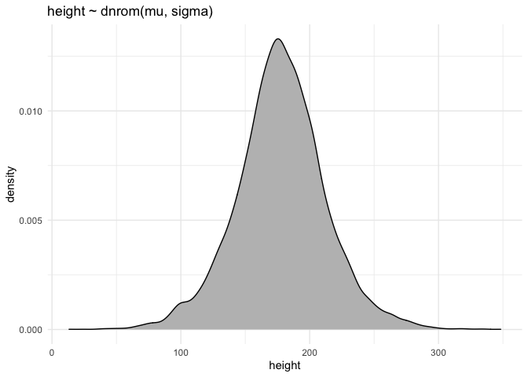<!-- -->

# Use grid approximation of the posterior

``` r
n <- 200                              # We'll use a 200 X 200 grid

# Create a function
grid_function <- function(mu, sd, data){
  sum(
    dnorm(x = data, mean = mu, sd = sd, log = TRUE)
  )
}

# Pull a vector to use
heights <- pull(d2, height)

# Create the grid, and call the function
d_grid <- 
  crossing(mu = seq(from = 140, to = 160, length.out = n),
           sigma = seq(from = 4, to = 9, length.out = n)) %>% 
  mutate(log_likelihood = map2_dbl(mu, sigma, grid_function, data = heights),
         prior_mu  = dnorm(x = mu, mean = 178, sd = 20, log = TRUE),
         prior_sigma = dunif(x = sigma, min = 0, max = 50, log = TRUE),
         prod = log_likelihood +  prior_mu + prior_sigma,
         prob = exp(prod - max(prod))) 
```

## Plot this grid

``` r
ggplot(data = d_grid, mapping = aes(x = mu, y = sigma, z = prob, fill = prob)) +
  geom_raster(alpha = 0.8) +
  geom_contour(color = "black") +
  scale_fill_viridis_c() +
  theme_minimal()
```

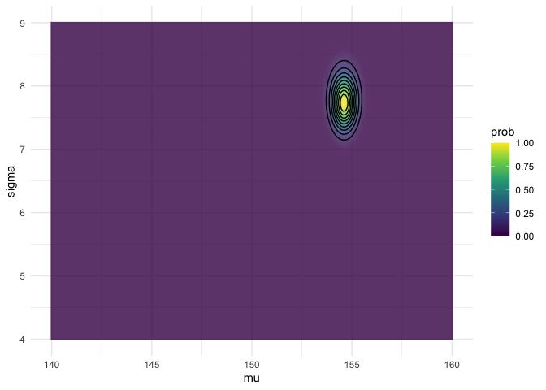<!-- -->

# Sample from the posterior

``` r
d_grid_samples <- 
  d_grid %>% 
  sample_n(size = 1e4, replace = T, weight = prob)

ggplot(data = d_grid_samples,
       mapping = aes(x = mu, y = sigma)) +
  geom_point(size = 1, alpha = 0.1) +
  theme_minimal()
```

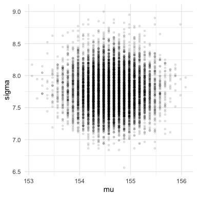<!-- -->

Let’s inspect the posteriors of each parameter

``` r
d_grid_samples %>% 
  pivot_longer(mu:sigma) %>% 
  ggplot(aes(x = value)) +
  geom_density(fill = "gray") +
  facet_wrap(~name, scales = "free") +
  theme_minimal()
```

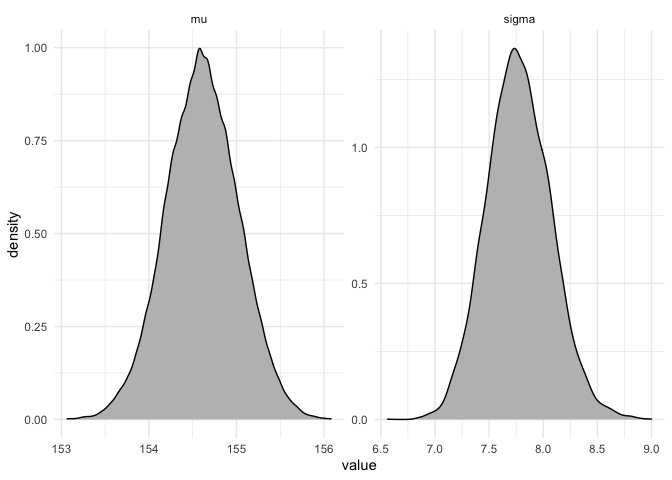<!-- -->

# Estimate the posterior with functions

First using `quap`

``` r
flist <- alist(
  height ~ dnorm(mu, sigma),
  mu ~ dnorm(178, 20), 
  sigma ~ dunif(0, 50)
)

model <- quap(flist, data = d2)

precis(model)
```

    ##             mean        sd       5.5%      94.5%
    ## mu    154.607023 0.4119947 153.948576 155.265470
    ## sigma   7.731333 0.2913860   7.265642   8.197024

And now using brms::brm

``` r
model <- 
  brm(formula = height ~ 1, data = d2, family = gaussian,
      prior = c(prior(normal(178, 20), class = Intercept),
                prior(cauchy(0, 1), class = sigma)),
      iter = 2000,
      warmup = 1000,
      chains = 4,
      cores = 4)
```

    ## Compiling Stan program...

    ## Trying to compile a simple C file

    ## Running /Library/Frameworks/R.framework/Resources/bin/R CMD SHLIB foo.c
    ## /usr/local/opt/llvm/bin/clang -fopenmp -I"/Library/Frameworks/R.framework/Resources/include" -DNDEBUG   -I"/Library/Frameworks/R.framework/Versions/4.0/Resources/library/Rcpp/include/"  -I"/Library/Frameworks/R.framework/Versions/4.0/Resources/library/RcppEigen/include/"  -I"/Library/Frameworks/R.framework/Versions/4.0/Resources/library/RcppEigen/include/unsupported"  -I"/Library/Frameworks/R.framework/Versions/4.0/Resources/library/BH/include" -I"/Library/Frameworks/R.framework/Versions/4.0/Resources/library/StanHeaders/include/src/"  -I"/Library/Frameworks/R.framework/Versions/4.0/Resources/library/StanHeaders/include/"  -I"/Library/Frameworks/R.framework/Versions/4.0/Resources/library/RcppParallel/include/"  -I"/Library/Frameworks/R.framework/Versions/4.0/Resources/library/rstan/include" -DEIGEN_NO_DEBUG  -DBOOST_DISABLE_ASSERTS  -DBOOST_PENDING_INTEGER_LOG2_HPP  -DSTAN_THREADS  -DBOOST_NO_AUTO_PTR  -include '/Library/Frameworks/R.framework/Versions/4.0/Resources/library/StanHeaders/include/stan/math/prim/mat/fun/Eigen.hpp'  -D_REENTRANT -DRCPP_PARALLEL_USE_TBB=1   -I/usr/local/opt/gettext/include -I/usr/local/opt/llvm/include   -fPIC  -g -O3 -Wall -pedantic -std=gnu99 -mtune=native -pipe -c foo.c -o foo.o
    ## In file included from <built-in>:1:
    ## In file included from /Library/Frameworks/R.framework/Versions/4.0/Resources/library/StanHeaders/include/stan/math/prim/mat/fun/Eigen.hpp:13:
    ## In file included from /Library/Frameworks/R.framework/Versions/4.0/Resources/library/RcppEigen/include/Eigen/Dense:1:
    ## In file included from /Library/Frameworks/R.framework/Versions/4.0/Resources/library/RcppEigen/include/Eigen/Core:88:
    ## /Library/Frameworks/R.framework/Versions/4.0/Resources/library/RcppEigen/include/Eigen/src/Core/util/Macros.h:613:1: error: unknown type name 'namespace'
    ## namespace Eigen {
    ## ^
    ## /Library/Frameworks/R.framework/Versions/4.0/Resources/library/RcppEigen/include/Eigen/src/Core/util/Macros.h:613:16: error: expected ';' after top level declarator
    ## namespace Eigen {
    ##                ^
    ##                ;
    ## In file included from <built-in>:1:
    ## In file included from /Library/Frameworks/R.framework/Versions/4.0/Resources/library/StanHeaders/include/stan/math/prim/mat/fun/Eigen.hpp:13:
    ## In file included from /Library/Frameworks/R.framework/Versions/4.0/Resources/library/RcppEigen/include/Eigen/Dense:1:
    ## /Library/Frameworks/R.framework/Versions/4.0/Resources/library/RcppEigen/include/Eigen/Core:96:10: fatal error: 'complex' file not found
    ## #include <complex>
    ##          ^~~~~~~~~
    ## 3 errors generated.
    ## make: *** [foo.o] Error 1

    ## Start sampling

Inspect the chains

``` r
plot(model)
```

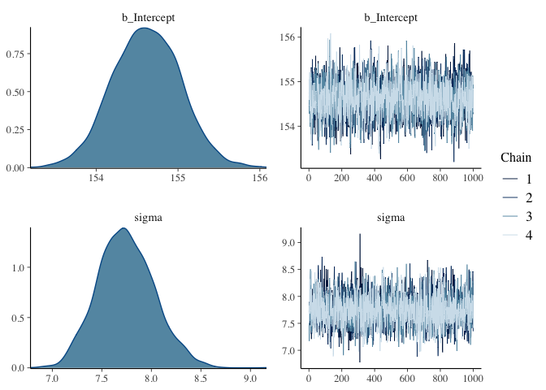<!-- -->

Lets use tighter priors

``` r
model_2 <- 
  brm(formula = height ~ 1, data = d2, family = gaussian,
      prior = c(prior(normal(178, 1), class = Intercept),
                prior(cauchy(0, 1), class = sigma)),
      iter = 2000,
      warmup = 1000,
      chains = 4,
      cores = 4)
```

    ## Compiling Stan program...

    ## Trying to compile a simple C file

    ## Running /Library/Frameworks/R.framework/Resources/bin/R CMD SHLIB foo.c
    ## /usr/local/opt/llvm/bin/clang -fopenmp -I"/Library/Frameworks/R.framework/Resources/include" -DNDEBUG   -I"/Library/Frameworks/R.framework/Versions/4.0/Resources/library/Rcpp/include/"  -I"/Library/Frameworks/R.framework/Versions/4.0/Resources/library/RcppEigen/include/"  -I"/Library/Frameworks/R.framework/Versions/4.0/Resources/library/RcppEigen/include/unsupported"  -I"/Library/Frameworks/R.framework/Versions/4.0/Resources/library/BH/include" -I"/Library/Frameworks/R.framework/Versions/4.0/Resources/library/StanHeaders/include/src/"  -I"/Library/Frameworks/R.framework/Versions/4.0/Resources/library/StanHeaders/include/"  -I"/Library/Frameworks/R.framework/Versions/4.0/Resources/library/RcppParallel/include/"  -I"/Library/Frameworks/R.framework/Versions/4.0/Resources/library/rstan/include" -DEIGEN_NO_DEBUG  -DBOOST_DISABLE_ASSERTS  -DBOOST_PENDING_INTEGER_LOG2_HPP  -DSTAN_THREADS  -DBOOST_NO_AUTO_PTR  -include '/Library/Frameworks/R.framework/Versions/4.0/Resources/library/StanHeaders/include/stan/math/prim/mat/fun/Eigen.hpp'  -D_REENTRANT -DRCPP_PARALLEL_USE_TBB=1   -I/usr/local/opt/gettext/include -I/usr/local/opt/llvm/include   -fPIC  -g -O3 -Wall -pedantic -std=gnu99 -mtune=native -pipe -c foo.c -o foo.o
    ## In file included from <built-in>:1:
    ## In file included from /Library/Frameworks/R.framework/Versions/4.0/Resources/library/StanHeaders/include/stan/math/prim/mat/fun/Eigen.hpp:13:
    ## In file included from /Library/Frameworks/R.framework/Versions/4.0/Resources/library/RcppEigen/include/Eigen/Dense:1:
    ## In file included from /Library/Frameworks/R.framework/Versions/4.0/Resources/library/RcppEigen/include/Eigen/Core:88:
    ## /Library/Frameworks/R.framework/Versions/4.0/Resources/library/RcppEigen/include/Eigen/src/Core/util/Macros.h:613:1: error: unknown type name 'namespace'
    ## namespace Eigen {
    ## ^
    ## /Library/Frameworks/R.framework/Versions/4.0/Resources/library/RcppEigen/include/Eigen/src/Core/util/Macros.h:613:16: error: expected ';' after top level declarator
    ## namespace Eigen {
    ##                ^
    ##                ;
    ## In file included from <built-in>:1:
    ## In file included from /Library/Frameworks/R.framework/Versions/4.0/Resources/library/StanHeaders/include/stan/math/prim/mat/fun/Eigen.hpp:13:
    ## In file included from /Library/Frameworks/R.framework/Versions/4.0/Resources/library/RcppEigen/include/Eigen/Dense:1:
    ## /Library/Frameworks/R.framework/Versions/4.0/Resources/library/RcppEigen/include/Eigen/Core:96:10: fatal error: 'complex' file not found
    ## #include <complex>
    ##          ^~~~~~~~~
    ## 3 errors generated.
    ## make: *** [foo.o] Error 1

    ## Start sampling

``` r
plot(model_2)
```

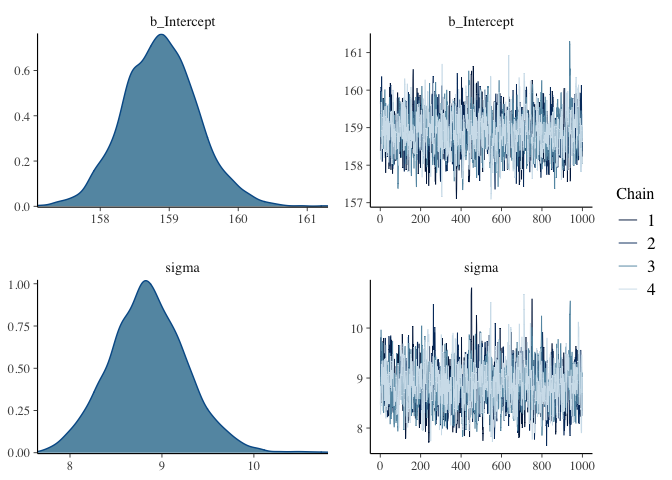<!-- -->

## Sampling from model fits

``` r
# Get the HMC chains out into a data.frame
post <- posterior_samples(model) %>% 
  select(b_Intercept, sigma)

post %>% 
  cov() %>% 
  diag()
```

    ## b_Intercept       sigma 
    ##  0.17067559  0.08167771

``` r
post %>% 
  cor()
```

    ##             b_Intercept      sigma
    ## b_Intercept  1.00000000 0.03157407
    ## sigma        0.03157407 1.00000000

``` r
posterior_summary(model)
```

    ##                 Estimate Est.Error         Q2.5        Q97.5
    ## b_Intercept   154.614989 0.4131290   153.808315   155.424784
    ## sigma           7.745052 0.2857931     7.214903     8.339534
    ## lp__        -1227.494712 0.9761719 -1230.169038 -1226.545041

# Now a linear model

  
 \\\\
\\mu_i &= a + \\beta(x_i - \\bar{x})\\\\
\\alpha &\\sim Normal(178, 20)\\\\
\\beta &\\sim Normal(0, 10) \\\\
\\sigma &\\sim Uniform(0, 50)
\\end{align}
")  

## Simulate priors

``` r
set.seed(2971)
n_lines <- 100

tibble(n = 1:n_lines,
       a = rnorm(n = n_lines, mean = 178, sd = 20),
       b = rnorm(n = n_lines, mean = 0, sd = 10)) %>% 
  expand(nesting(n, a, b), weight = range(d2$weight)) %>% 
  mutate(height = a + b * (weight - mean(d2$weight))) %>% 
  ggplot(aes(x = weight, y = height, group = paste(a, b))) +
  geom_line(size = 0.1) +
  theme_bw() +
  labs(title = "b ~ dnorm(0, 10)")
```

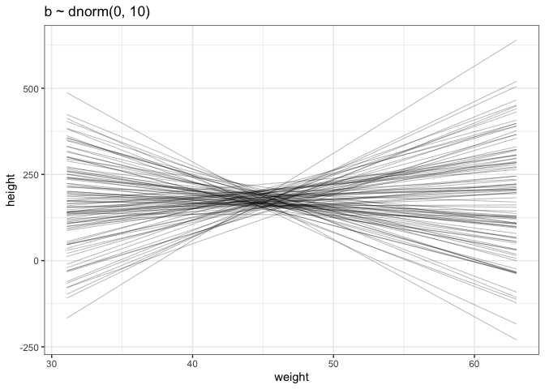<!-- -->

Lets modify the prior, because the prior simulations tell us it is shit.

  
 \\\\
\\mu_i &= a + \\beta(x_i - \\bar{x})\\\\
\\alpha &\\sim Normal(178, 20)\\\\
\\beta &\\sim Log-Normal(0, 1) \\\\
\\sigma &\\sim Uniform(0, 50)
\\end{align}
")  

## Simulate priors again

``` r
set.seed(2971)
n_lines <- 100

tibble(n = 1:n_lines,
       a = rnorm(n = n_lines, mean = 178, sd = 20),
       b = rlnorm(n = n_lines, mean = 0, sd = 1)) %>% 
  expand(nesting(n, a, b), weight = range(d2$weight)) %>% 
  mutate(height = a + b * (weight - mean(d2$weight))) %>% 
  ggplot(aes(x = weight, y = height, group = paste(a, b))) +
  geom_line(size = 0.1) +
  theme_bw() +
  labs(title = "b ~ dnorm(0, 10)")
```

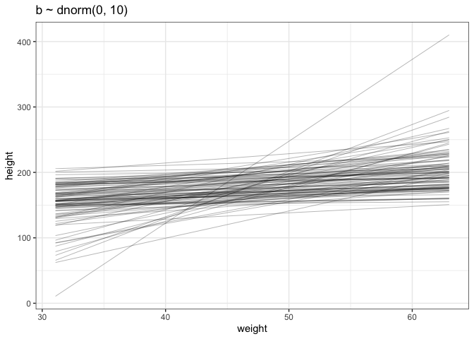<!-- -->

## Approximate the posterior using brms

``` r
d2 %<>%
  mutate(weight_c = weight - mean(weight, na.rm = T))

model <- 
  brm(formula = height ~ 1 + weight_c,
      data = d2,
      family = gaussian,
      prior = c(prior(normal(178, 20), class = Intercept),
                prior(lognormal(0, 1), class = b),
                prior(uniform(0, 50), class = sigma)),
      iter = 28000, warmup = 27000, chains = 4, cores = 8,
      seed = 4,
      file = "my_model"
      )

plot(model)
```

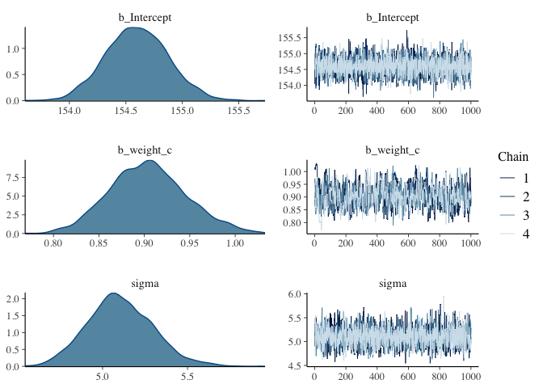<!-- -->

``` r
posterior_samples(model)[, 1:3] %>% 
  cov() %>% 
  round(digits = 3)
```

    ##             b_Intercept b_weight_c sigma
    ## b_Intercept       0.076      0.000 0.000
    ## b_weight_c        0.000      0.002 0.000
    ## sigma             0.000      0.000 0.036

``` r
pairs(model)
```

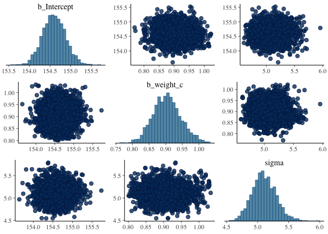<!-- --> \#\#
Plot predictions

``` r
ggplot(data = d2, mapping = aes(x = weight_c, y = height)) +
  geom_point() +
  geom_abline(intercept = fixef(model)[1],
              slope = fixef(model)[2])
```

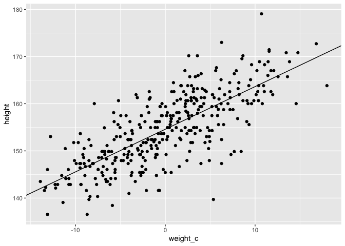<!-- -->

### Add uncertainty around the mean

``` r
weight_seq <- 
  tibble(weight = 25:70) %>% 
  mutate(weight_c = weight - mean(d2$weight))

mu_summary <- 
  fitted(model, newdata = weight_seq) %>% 
  data.frame() %>% 
  bind_cols(weight_seq)


ggplot(data = d2, mapping = aes(x = weight_c)) +
  geom_point(aes(y = height)) +
  geom_smooth(data = mu_summary,
              aes(y = Estimate, ymin = Q2.5, ymax = Q97.5),
              stat = "identity",
              fill = "red",
              size = 1,
              alpha = 0.5,
              color = "black") +
  theme_bw()
```

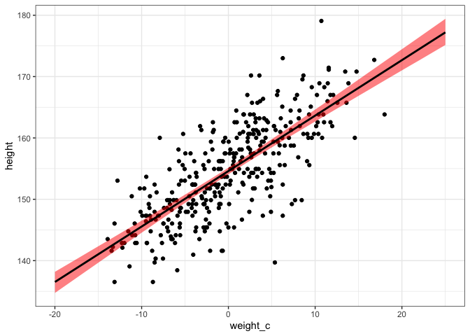<!-- -->

### Add uncertainty around the entire prediction

``` r
pred_height <- 
  predict(model, newdata = weight_seq) %>% 
  data.frame() %>% 
  bind_cols(weight_seq)

ggplot(data = d2, mapping = aes(x = weight_c)) +
  geom_point(aes(y = height)) +
  geom_ribbon(data = pred_height,
              aes(ymin = Q2.5, ymax = Q97.5),
              alpha = 0.5) +
  geom_smooth(data = mu_summary,
              aes(y = Estimate, ymin = Q2.5, ymax = Q97.5),
              stat = "identity",
              fill = "red",
              size = 1,
              alpha = 0.5,
              color = "black") +
  theme_bw()
```

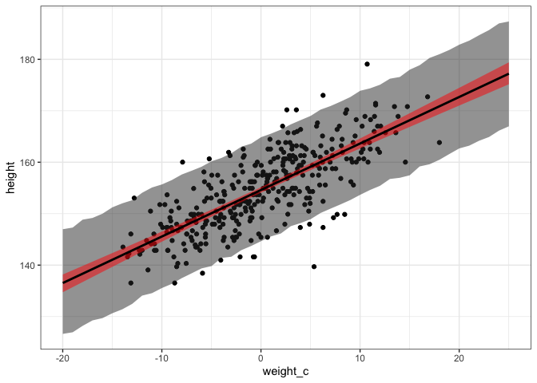<!-- -->

# Quadratic model

  
 \\\\
\\mu_i &= a + \\beta_1weight\\_s_i + \\beta_2weight\\_s_i^2\\\\
\\alpha &\\sim Normal(178, 20)\\\\
\\beta_1 &\\sim Log-Normal(0, 1) \\\\
\\beta_2 &\\sim Normal(0, 1) \\\\
\\sigma &\\sim Uniform(0, 50)
\\end{align}
")  

## Simulating from the priors

``` r
set.seed(2971)
n_lines <- 100

tibble(n = 1:n_lines,
       a = rnorm(n = n_lines, mean = 178, sd = 20),
       b_1 = rlnorm(n = n_lines, mean = 0, sd = 1),
       b_2 = rnorm(n = n_lines, mean = 0, sd = 1)) %>% 
  expand(nesting(n, a, b_1, b_2), weight = seq(4, 63, by = 5)) %>% 
  mutate(height = a + b_1* (weight - mean(d$weight)) + (b_2 * (weight - mean(d$weight)) ^ 2)) %>% 
  ggplot(aes(x = weight, y = height)) +
  geom_point(data = d) +
  geom_line(size = 0.1, aes(group = n)) +
  theme_bw() +
  labs(title = "b ~ dnorm(0, 10)")
```

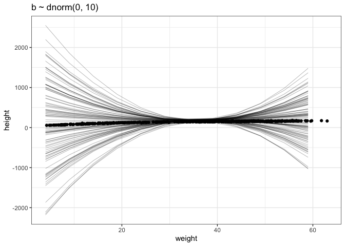<!-- -->

## Fit the model

``` r
d %<>%
  mutate(weight_s = (weight - mean(weight, na.rm = T)) / sd(weight, na.rm = T),
         weight_s2 = weight_s ^ 2)

model <- brm(
  formula = height ~ 1 + weight_s + weight_s2,
  data = d,
  family = gaussian,
  prior = c(prior(normal(178, 100), class = Intercept),
            prior(lognormal(0, 1), class = b, coef = "weight_s"),
            prior(normal(0, 1), class = b, coef = "weight_s2"),
            prior(uniform(0, 50), class = sigma)),
  iter = 30000, warmup = 29000, chains = 4, cores = 4,
  seed = 4
)
```

    ## Warning: It appears as if you have specified a lower bounded prior on a parameter that has no natural lower bound.
    ## If this is really what you want, please specify argument 'lb' of 'set_prior' appropriately.
    ## Warning occurred for prior 
    ## b_weight_s ~ lognormal(0, 1)

    ## Warning: It appears as if you have specified an upper bounded prior on a parameter that has no natural upper bound.
    ## If this is really what you want, please specify argument 'ub' of 'set_prior' appropriately.
    ## Warning occurred for prior 
    ## sigma ~ uniform(0, 50)

    ## Compiling Stan program...

    ## Trying to compile a simple C file

    ## Running /Library/Frameworks/R.framework/Resources/bin/R CMD SHLIB foo.c
    ## /usr/local/opt/llvm/bin/clang -fopenmp -I"/Library/Frameworks/R.framework/Resources/include" -DNDEBUG   -I"/Library/Frameworks/R.framework/Versions/4.0/Resources/library/Rcpp/include/"  -I"/Library/Frameworks/R.framework/Versions/4.0/Resources/library/RcppEigen/include/"  -I"/Library/Frameworks/R.framework/Versions/4.0/Resources/library/RcppEigen/include/unsupported"  -I"/Library/Frameworks/R.framework/Versions/4.0/Resources/library/BH/include" -I"/Library/Frameworks/R.framework/Versions/4.0/Resources/library/StanHeaders/include/src/"  -I"/Library/Frameworks/R.framework/Versions/4.0/Resources/library/StanHeaders/include/"  -I"/Library/Frameworks/R.framework/Versions/4.0/Resources/library/RcppParallel/include/"  -I"/Library/Frameworks/R.framework/Versions/4.0/Resources/library/rstan/include" -DEIGEN_NO_DEBUG  -DBOOST_DISABLE_ASSERTS  -DBOOST_PENDING_INTEGER_LOG2_HPP  -DSTAN_THREADS  -DBOOST_NO_AUTO_PTR  -include '/Library/Frameworks/R.framework/Versions/4.0/Resources/library/StanHeaders/include/stan/math/prim/mat/fun/Eigen.hpp'  -D_REENTRANT -DRCPP_PARALLEL_USE_TBB=1   -I/usr/local/opt/gettext/include -I/usr/local/opt/llvm/include   -fPIC  -g -O3 -Wall -pedantic -std=gnu99 -mtune=native -pipe -c foo.c -o foo.o
    ## In file included from <built-in>:1:
    ## In file included from /Library/Frameworks/R.framework/Versions/4.0/Resources/library/StanHeaders/include/stan/math/prim/mat/fun/Eigen.hpp:13:
    ## In file included from /Library/Frameworks/R.framework/Versions/4.0/Resources/library/RcppEigen/include/Eigen/Dense:1:
    ## In file included from /Library/Frameworks/R.framework/Versions/4.0/Resources/library/RcppEigen/include/Eigen/Core:88:
    ## /Library/Frameworks/R.framework/Versions/4.0/Resources/library/RcppEigen/include/Eigen/src/Core/util/Macros.h:613:1: error: unknown type name 'namespace'
    ## namespace Eigen {
    ## ^
    ## /Library/Frameworks/R.framework/Versions/4.0/Resources/library/RcppEigen/include/Eigen/src/Core/util/Macros.h:613:16: error: expected ';' after top level declarator
    ## namespace Eigen {
    ##                ^
    ##                ;
    ## In file included from <built-in>:1:
    ## In file included from /Library/Frameworks/R.framework/Versions/4.0/Resources/library/StanHeaders/include/stan/math/prim/mat/fun/Eigen.hpp:13:
    ## In file included from /Library/Frameworks/R.framework/Versions/4.0/Resources/library/RcppEigen/include/Eigen/Dense:1:
    ## /Library/Frameworks/R.framework/Versions/4.0/Resources/library/RcppEigen/include/Eigen/Core:96:10: fatal error: 'complex' file not found
    ## #include <complex>
    ##          ^~~~~~~~~
    ## 3 errors generated.
    ## make: *** [foo.o] Error 1

    ## Start sampling

``` r
plot(model)
```

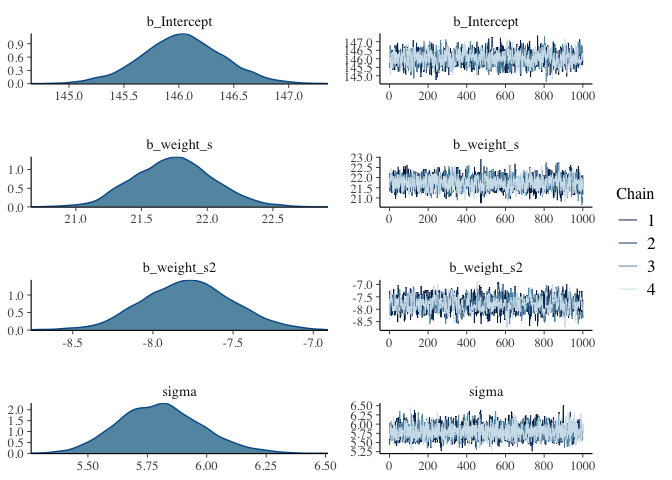<!-- --> \#\#
And plot it

``` r
weight_seq <- 
  tibble(weight_s = seq(from = -2.5, to = 2.5, length.out = 30)) %>% 
  mutate(weight_s2 = weight_s ^ 2)

mu_summary <- 
  fitted(model, newdata = weight_seq) %>% 
  data.frame() %>% 
  bind_cols(weight_seq)

pred_height <- 
  predict(model, newdata = weight_seq) %>% 
  data.frame() %>% 
  bind_cols(weight_seq)

ggplot(data = d, mapping = aes(x = weight_s)) +
  geom_point(aes(y = height)) +
  geom_ribbon(data = pred_height,
              aes(ymin = Q2.5, ymax = Q97.5),
              alpha = 0.5) +
  geom_smooth(data = mu_summary,
              aes(y = Estimate, ymin = Q2.5, ymax = Q97.5),
              stat = "identity",
              fill = "red",
              size = 1,
              alpha = 0.5,
              color = "black") +
  theme_bw()
```

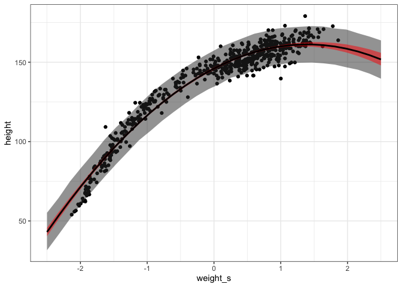<!-- -->

# Now a cubic model

  
 \\\\
\\mu_i &= a + \\beta_1weight\\_s_i + \\beta_2weight\\_s_i^2 + \\beta_3weight\\_s_i^3\\\\
\\alpha &\\sim Normal(178, 20)\\\\
\\beta_1 &\\sim Log-Normal(0, 1) \\\\
\\beta_2 &\\sim Normal(0, 1) \\\\
\\beta_3 &\\sim Normal(0, 1) \\\\
\\sigma &\\sim Uniform(0, 50)
\\end{align}
")  

## Simulate the priors

``` r
set.seed(2971)
n_lines <- 100

tibble(n = 1:n_lines,
       a = rnorm(n = n_lines, mean = 178, sd = 20),
       b_1 = rlnorm(n = n_lines, mean = 0, sd = 1),
       b_2 = rnorm(n = n_lines, mean = 0, sd = 1),
       b_3 = rnorm(n = n_lines, mean = 0, sd = 1)) %>% 
  expand(nesting(n, a, b_1, b_2, b_3), weight = seq(4, 63, length.out = 20)) %>% 
  mutate(height = a + b_1* (weight - mean(d$weight)) + (b_2 * (weight - mean(d$weight)) ^ 2) + (b_3 * (weight - mean(d$weight)) ^ 3)) %>% 
  ggplot(aes(x = weight, y = height, group = n)) +
  geom_line(size = 0.1) +
  theme_bw() +
  labs(title = "b ~ dnorm(0, 10)")
```

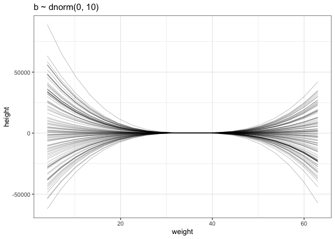<!-- -->

## Fit the model

``` r
d %<>%
  mutate(weight_s = (weight - mean(weight, na.rm = T)) / sd(weight, na.rm = T),
         weight_s2 = weight_s ^ 2,
         weight_s3 = weight_s ^ 3)

model <- brm(
  formula = height ~ 1 + weight_s + weight_s2 + weight_s3,
  data = d,
  family = gaussian,
  prior = c(prior(normal(178, 100), class = Intercept),
            prior(lognormal(0, 1), class = b, coef = "weight_s"),
            prior(normal(0, 1), class = b, coef = "weight_s2"),
            prior(normal(0, 1), class = b, coef = "weight_s3"),
            prior(uniform(0, 50), class = sigma)),
  iter = 30000, warmup = 29000, chains = 4, cores = 4,
  seed = 4
)
```

    ## Warning: It appears as if you have specified a lower bounded prior on a parameter that has no natural lower bound.
    ## If this is really what you want, please specify argument 'lb' of 'set_prior' appropriately.
    ## Warning occurred for prior 
    ## b_weight_s ~ lognormal(0, 1)

    ## Warning: It appears as if you have specified an upper bounded prior on a parameter that has no natural upper bound.
    ## If this is really what you want, please specify argument 'ub' of 'set_prior' appropriately.
    ## Warning occurred for prior 
    ## sigma ~ uniform(0, 50)

    ## Compiling Stan program...

    ## Trying to compile a simple C file

    ## Running /Library/Frameworks/R.framework/Resources/bin/R CMD SHLIB foo.c
    ## /usr/local/opt/llvm/bin/clang -fopenmp -I"/Library/Frameworks/R.framework/Resources/include" -DNDEBUG   -I"/Library/Frameworks/R.framework/Versions/4.0/Resources/library/Rcpp/include/"  -I"/Library/Frameworks/R.framework/Versions/4.0/Resources/library/RcppEigen/include/"  -I"/Library/Frameworks/R.framework/Versions/4.0/Resources/library/RcppEigen/include/unsupported"  -I"/Library/Frameworks/R.framework/Versions/4.0/Resources/library/BH/include" -I"/Library/Frameworks/R.framework/Versions/4.0/Resources/library/StanHeaders/include/src/"  -I"/Library/Frameworks/R.framework/Versions/4.0/Resources/library/StanHeaders/include/"  -I"/Library/Frameworks/R.framework/Versions/4.0/Resources/library/RcppParallel/include/"  -I"/Library/Frameworks/R.framework/Versions/4.0/Resources/library/rstan/include" -DEIGEN_NO_DEBUG  -DBOOST_DISABLE_ASSERTS  -DBOOST_PENDING_INTEGER_LOG2_HPP  -DSTAN_THREADS  -DBOOST_NO_AUTO_PTR  -include '/Library/Frameworks/R.framework/Versions/4.0/Resources/library/StanHeaders/include/stan/math/prim/mat/fun/Eigen.hpp'  -D_REENTRANT -DRCPP_PARALLEL_USE_TBB=1   -I/usr/local/opt/gettext/include -I/usr/local/opt/llvm/include   -fPIC  -g -O3 -Wall -pedantic -std=gnu99 -mtune=native -pipe -c foo.c -o foo.o
    ## In file included from <built-in>:1:
    ## In file included from /Library/Frameworks/R.framework/Versions/4.0/Resources/library/StanHeaders/include/stan/math/prim/mat/fun/Eigen.hpp:13:
    ## In file included from /Library/Frameworks/R.framework/Versions/4.0/Resources/library/RcppEigen/include/Eigen/Dense:1:
    ## In file included from /Library/Frameworks/R.framework/Versions/4.0/Resources/library/RcppEigen/include/Eigen/Core:88:
    ## /Library/Frameworks/R.framework/Versions/4.0/Resources/library/RcppEigen/include/Eigen/src/Core/util/Macros.h:613:1: error: unknown type name 'namespace'
    ## namespace Eigen {
    ## ^
    ## /Library/Frameworks/R.framework/Versions/4.0/Resources/library/RcppEigen/include/Eigen/src/Core/util/Macros.h:613:16: error: expected ';' after top level declarator
    ## namespace Eigen {
    ##                ^
    ##                ;
    ## In file included from <built-in>:1:
    ## In file included from /Library/Frameworks/R.framework/Versions/4.0/Resources/library/StanHeaders/include/stan/math/prim/mat/fun/Eigen.hpp:13:
    ## In file included from /Library/Frameworks/R.framework/Versions/4.0/Resources/library/RcppEigen/include/Eigen/Dense:1:
    ## /Library/Frameworks/R.framework/Versions/4.0/Resources/library/RcppEigen/include/Eigen/Core:96:10: fatal error: 'complex' file not found
    ## #include <complex>
    ##          ^~~~~~~~~
    ## 3 errors generated.
    ## make: *** [foo.o] Error 1

    ## Start sampling

``` r
plot(model)
```

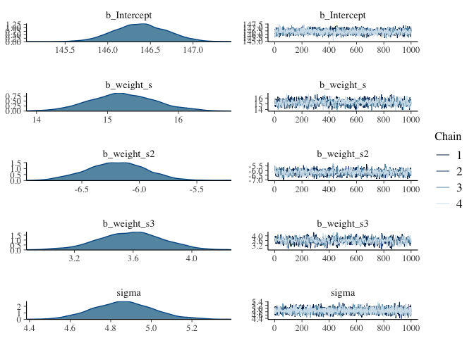<!-- -->

## And plot it

``` r
weight_seq %<>%
  mutate(weight_s3 = weight_s ^ 3)

mu_summary <- 
  fitted(model, newdata = weight_seq) %>% 
  data.frame() %>% 
  bind_cols(weight_seq)

pred_height <- 
  predict(model, newdata = weight_seq) %>% 
  data.frame() %>% 
  bind_cols(weight_seq)

ggplot(data = d, mapping = aes(x = weight_s)) +
  geom_point(aes(y = height)) +
  geom_ribbon(data = pred_height,
              aes(ymin = Q2.5, ymax = Q97.5),
              alpha = 0.5) +
  geom_smooth(data = mu_summary,
              aes(y = Estimate, ymin = Q2.5, ymax = Q97.5),
              stat = "identity",
              fill = "red",
              size = 1,
              alpha = 0.5,
              color = "black") +
  theme_bw()
```

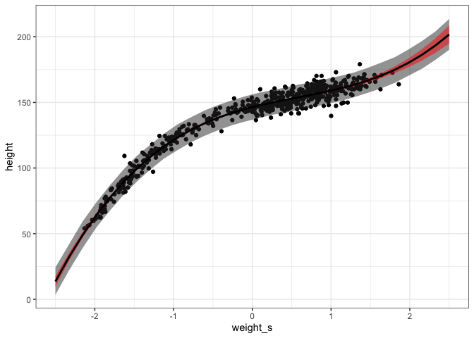<!-- -->

# What about a linear model on the entire data?

## Simulate the priors

``` r
set.seed(2971)
n_lines <- 100

tibble(n = 1:n_lines,
       a = rnorm(n = n_lines, mean = 178, sd = 20),
       b = rlnorm(n = n_lines, mean = 0, sd = 1)) %>% 
  expand(nesting(n, a, b), weight = seq(4, 63, length.out = 20)) %>% 
  mutate(height = a + b * (weight - mean(d$weight))) %>% 
  ggplot(aes(x = weight, y = height)) +
  geom_point(data = d) +
  geom_line(size = 0.1, aes(group = n)) +
  theme_bw() +
  labs(title = "b ~ dnorm(0, 10)")
```

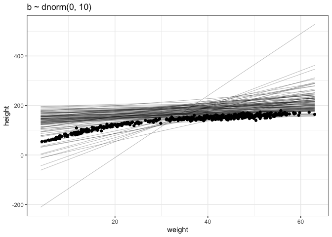<!-- -->

## Fit the model

``` r
d %<>%
  mutate(weight_s = (weight - mean(weight, na.rm = T)) / sd(weight, na.rm = T))

model <- brm(
  formula = height ~ 1 + weight_s,
  data = d,
  family = gaussian,
  prior = c(prior(normal(178, 100), class = Intercept),
            prior(lognormal(0, 1), class = b, coef = "weight_s"),
            prior(uniform(0, 50), class = sigma)),
  iter = 40000, warmup = 39000, chains = 4, cores = 4,
  seed = 4
)
```

    ## Warning: It appears as if you have specified a lower bounded prior on a parameter that has no natural lower bound.
    ## If this is really what you want, please specify argument 'lb' of 'set_prior' appropriately.
    ## Warning occurred for prior 
    ## b_weight_s ~ lognormal(0, 1)

    ## Warning: It appears as if you have specified an upper bounded prior on a parameter that has no natural upper bound.
    ## If this is really what you want, please specify argument 'ub' of 'set_prior' appropriately.
    ## Warning occurred for prior 
    ## sigma ~ uniform(0, 50)

    ## Compiling Stan program...

    ## Trying to compile a simple C file

    ## Running /Library/Frameworks/R.framework/Resources/bin/R CMD SHLIB foo.c
    ## /usr/local/opt/llvm/bin/clang -fopenmp -I"/Library/Frameworks/R.framework/Resources/include" -DNDEBUG   -I"/Library/Frameworks/R.framework/Versions/4.0/Resources/library/Rcpp/include/"  -I"/Library/Frameworks/R.framework/Versions/4.0/Resources/library/RcppEigen/include/"  -I"/Library/Frameworks/R.framework/Versions/4.0/Resources/library/RcppEigen/include/unsupported"  -I"/Library/Frameworks/R.framework/Versions/4.0/Resources/library/BH/include" -I"/Library/Frameworks/R.framework/Versions/4.0/Resources/library/StanHeaders/include/src/"  -I"/Library/Frameworks/R.framework/Versions/4.0/Resources/library/StanHeaders/include/"  -I"/Library/Frameworks/R.framework/Versions/4.0/Resources/library/RcppParallel/include/"  -I"/Library/Frameworks/R.framework/Versions/4.0/Resources/library/rstan/include" -DEIGEN_NO_DEBUG  -DBOOST_DISABLE_ASSERTS  -DBOOST_PENDING_INTEGER_LOG2_HPP  -DSTAN_THREADS  -DBOOST_NO_AUTO_PTR  -include '/Library/Frameworks/R.framework/Versions/4.0/Resources/library/StanHeaders/include/stan/math/prim/mat/fun/Eigen.hpp'  -D_REENTRANT -DRCPP_PARALLEL_USE_TBB=1   -I/usr/local/opt/gettext/include -I/usr/local/opt/llvm/include   -fPIC  -g -O3 -Wall -pedantic -std=gnu99 -mtune=native -pipe -c foo.c -o foo.o
    ## In file included from <built-in>:1:
    ## In file included from /Library/Frameworks/R.framework/Versions/4.0/Resources/library/StanHeaders/include/stan/math/prim/mat/fun/Eigen.hpp:13:
    ## In file included from /Library/Frameworks/R.framework/Versions/4.0/Resources/library/RcppEigen/include/Eigen/Dense:1:
    ## In file included from /Library/Frameworks/R.framework/Versions/4.0/Resources/library/RcppEigen/include/Eigen/Core:88:
    ## /Library/Frameworks/R.framework/Versions/4.0/Resources/library/RcppEigen/include/Eigen/src/Core/util/Macros.h:613:1: error: unknown type name 'namespace'
    ## namespace Eigen {
    ## ^
    ## /Library/Frameworks/R.framework/Versions/4.0/Resources/library/RcppEigen/include/Eigen/src/Core/util/Macros.h:613:16: error: expected ';' after top level declarator
    ## namespace Eigen {
    ##                ^
    ##                ;
    ## In file included from <built-in>:1:
    ## In file included from /Library/Frameworks/R.framework/Versions/4.0/Resources/library/StanHeaders/include/stan/math/prim/mat/fun/Eigen.hpp:13:
    ## In file included from /Library/Frameworks/R.framework/Versions/4.0/Resources/library/RcppEigen/include/Eigen/Dense:1:
    ## /Library/Frameworks/R.framework/Versions/4.0/Resources/library/RcppEigen/include/Eigen/Core:96:10: fatal error: 'complex' file not found
    ## #include <complex>
    ##          ^~~~~~~~~
    ## 3 errors generated.
    ## make: *** [foo.o] Error 1

    ## Start sampling

    ## Warning: There were 305 divergent transitions after warmup. See
    ## http://mc-stan.org/misc/warnings.html#divergent-transitions-after-warmup
    ## to find out why this is a problem and how to eliminate them.

    ## Warning: There were 1 chains where the estimated Bayesian Fraction of Missing Information was low. See
    ## http://mc-stan.org/misc/warnings.html#bfmi-low

    ## Warning: Examine the pairs() plot to diagnose sampling problems

    ## Warning: The largest R-hat is 1.57, indicating chains have not mixed.
    ## Running the chains for more iterations may help. See
    ## http://mc-stan.org/misc/warnings.html#r-hat

    ## Warning: Bulk Effective Samples Size (ESS) is too low, indicating posterior means and medians may be unreliable.
    ## Running the chains for more iterations may help. See
    ## http://mc-stan.org/misc/warnings.html#bulk-ess

    ## Warning: Tail Effective Samples Size (ESS) is too low, indicating posterior variances and tail quantiles may be unreliable.
    ## Running the chains for more iterations may help. See
    ## http://mc-stan.org/misc/warnings.html#tail-ess

``` r
plot(model)
```

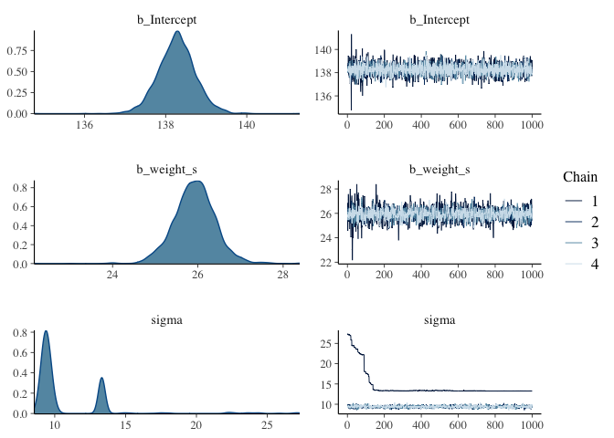<!-- -->

## And plot it

``` r
mu_summary <- 
  fitted(model, newdata = weight_seq) %>% 
  data.frame() %>% 
  bind_cols(weight_seq)

pred_height <- 
  predict(model, newdata = weight_seq) %>% 
  data.frame() %>% 
  bind_cols(weight_seq)

ggplot(data = d, mapping = aes(x = weight_s)) +
  geom_point(aes(y = height)) +
  geom_ribbon(data = pred_height,
              aes(ymin = Q2.5, ymax = Q97.5),
              alpha = 0.5) +
  geom_smooth(data = mu_summary,
              aes(y = Estimate, ymin = Q2.5, ymax = Q97.5),
              stat = "identity",
              fill = "red",
              size = 1,
              alpha = 0.5,
              color = "black") +
  theme_bw()
```

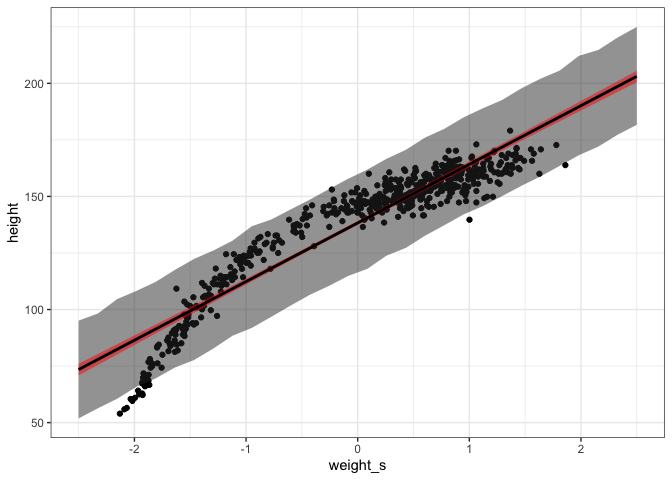<!-- -->

# Splines

``` r
data(cherry_blossoms)
d <- cherry_blossoms
```

## Visualize the data

``` r
ggplot(data = d,
       mapping = aes(x = year, y = temp)) +
  geom_line() +
  geom_point()
```

    ## Warning: Removed 73 row(s) containing missing values (geom_path).

    ## Warning: Removed 91 rows containing missing values (geom_point).

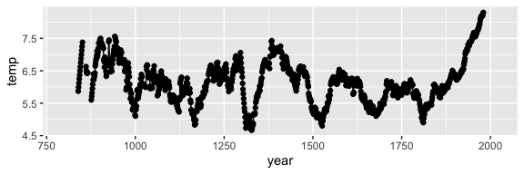<!-- -->
