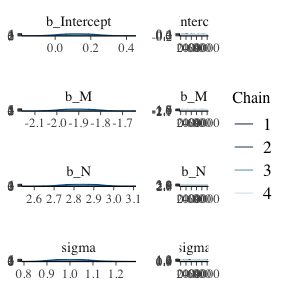

Lectures 5 - 6
================
Juan Carlos Villaseñor-Derbez
12/15/2020

# Spurious associations

## Visualize data

``` r
ggplot(data = d, mapping = aes(x = a, y = d)) +
  geom_point() +
  labs(x = "Standardized age-at-marriage",
       y = "Standardized divorce rate") +
  theme_bw()
```

<!-- -->

## Model 1

### Define a model

We are interested in modeling divorce rates as dependent variables of
marriage rates and median age of marriage. But first, we’ll test for the
relationship between divorce rate and age of marriage, a know causal
path.

  
 \\\\
\\mu_i = \\alpha + \\beta_1 a_i \\\\
\\alpha \\sim \\text{Normal}(0, 0.2)\\\\
\\beta_1 \\sim \\text{Normal}(0, 0.5) \\\\
\\sigma \\sim \\text{Exponential}(1)
")  

### Sample from the priors

``` r
n_lines <- 50

tibble(n = 1:n_lines,
       Intercept = rnorm(n = n_lines, mean = 0, sd = 0.2),
       b = rnorm(n = n_lines, mean = 0, sd = 0.5)) %>%
  expand(nesting(n, Intercept, b), age = c(-2, 2)) %>%
  mutate(divorce = Intercept + b * age) %>% 
  ggplot(aes(x = age, y = divorce, group = n)) +
  geom_line() +
  labs(x = "Standardized age-at-marriage",
       y = "Standardized divorce rate",
       title = "b ~ dnorm(0, 0.5); a ~ dnorm(0, 0.2)") +
  theme_bw()
```

<!-- -->

### Fit the model

``` r
model <- brm(formula = d ~ 1 + a,
             data = d,
             family = gaussian,
             prior = c(prior(normal(0, 0.2), class = Intercept),
                       prior(normal(0, 0.5), class = b),
                       prior(exponential(1), class = sigma)),
             seed = 5,
             chains = 4,
             cores = 4)
```

    ## Compiling Stan program...

    ## Trying to compile a simple C file

    ## Running /Library/Frameworks/R.framework/Resources/bin/R CMD SHLIB foo.c
    ## /usr/local/opt/llvm/bin/clang -fopenmp -I"/Library/Frameworks/R.framework/Resources/include" -DNDEBUG   -I"/Library/Frameworks/R.framework/Versions/4.0/Resources/library/Rcpp/include/"  -I"/Library/Frameworks/R.framework/Versions/4.0/Resources/library/RcppEigen/include/"  -I"/Library/Frameworks/R.framework/Versions/4.0/Resources/library/RcppEigen/include/unsupported"  -I"/Library/Frameworks/R.framework/Versions/4.0/Resources/library/BH/include" -I"/Library/Frameworks/R.framework/Versions/4.0/Resources/library/StanHeaders/include/src/"  -I"/Library/Frameworks/R.framework/Versions/4.0/Resources/library/StanHeaders/include/"  -I"/Library/Frameworks/R.framework/Versions/4.0/Resources/library/RcppParallel/include/"  -I"/Library/Frameworks/R.framework/Versions/4.0/Resources/library/rstan/include" -DEIGEN_NO_DEBUG  -DBOOST_DISABLE_ASSERTS  -DBOOST_PENDING_INTEGER_LOG2_HPP  -DSTAN_THREADS  -DBOOST_NO_AUTO_PTR  -include '/Library/Frameworks/R.framework/Versions/4.0/Resources/library/StanHeaders/include/stan/math/prim/mat/fun/Eigen.hpp'  -D_REENTRANT -DRCPP_PARALLEL_USE_TBB=1   -I/usr/local/opt/gettext/include -I/usr/local/opt/llvm/include   -fPIC  -g -O3 -Wall -pedantic -std=gnu99 -mtune=native -pipe -c foo.c -o foo.o
    ## In file included from <built-in>:1:
    ## In file included from /Library/Frameworks/R.framework/Versions/4.0/Resources/library/StanHeaders/include/stan/math/prim/mat/fun/Eigen.hpp:13:
    ## In file included from /Library/Frameworks/R.framework/Versions/4.0/Resources/library/RcppEigen/include/Eigen/Dense:1:
    ## In file included from /Library/Frameworks/R.framework/Versions/4.0/Resources/library/RcppEigen/include/Eigen/Core:88:
    ## /Library/Frameworks/R.framework/Versions/4.0/Resources/library/RcppEigen/include/Eigen/src/Core/util/Macros.h:613:1: error: unknown type name 'namespace'
    ## namespace Eigen {
    ## ^
    ## /Library/Frameworks/R.framework/Versions/4.0/Resources/library/RcppEigen/include/Eigen/src/Core/util/Macros.h:613:16: error: expected ';' after top level declarator
    ## namespace Eigen {
    ##                ^
    ##                ;
    ## In file included from <built-in>:1:
    ## In file included from /Library/Frameworks/R.framework/Versions/4.0/Resources/library/StanHeaders/include/stan/math/prim/mat/fun/Eigen.hpp:13:
    ## In file included from /Library/Frameworks/R.framework/Versions/4.0/Resources/library/RcppEigen/include/Eigen/Dense:1:
    ## /Library/Frameworks/R.framework/Versions/4.0/Resources/library/RcppEigen/include/Eigen/Core:96:10: fatal error: 'complex' file not found
    ## #include <complex>
    ##          ^~~~~~~~~
    ## 3 errors generated.
    ## make: *** [foo.o] Error 1

    ## Start sampling

### Inspect the fit

``` r
model
```

    ##  Family: gaussian 
    ##   Links: mu = identity; sigma = identity 
    ## Formula: d ~ 1 + a 
    ##    Data: d (Number of observations: 50) 
    ## Samples: 4 chains, each with iter = 2000; warmup = 1000; thin = 1;
    ##          total post-warmup samples = 4000
    ## 
    ## Population-Level Effects: 
    ##           Estimate Est.Error l-95% CI u-95% CI Rhat Bulk_ESS Tail_ESS
    ## Intercept    -0.00      0.10    -0.19     0.19 1.00     3816     2958
    ## a            -0.57      0.12    -0.79    -0.34 1.00     4168     2703
    ## 
    ## Family Specific Parameters: 
    ##       Estimate Est.Error l-95% CI u-95% CI Rhat Bulk_ESS Tail_ESS
    ## sigma     0.82      0.08     0.68     1.00 1.00     3719     2769
    ## 
    ## Samples were drawn using sampling(NUTS). For each parameter, Bulk_ESS
    ## and Tail_ESS are effective sample size measures, and Rhat is the potential
    ## scale reduction factor on split chains (at convergence, Rhat = 1).

### Visualize the fit

``` r
new_data <- tibble(a = seq(from = 1.05 * min(d$a), to = 1.05 * max(d$a), length.out = 30))

trend_line <- fitted(model, newdata = new_data) %>% 
  data.frame() %>% 
  bind_cols(new_data)

values <- predict(model, newdata = new_data) %>% 
  data.frame() %>% 
  bind_cols(new_data)

ggplot(mapping = aes(x = a)) +
  geom_ribbon(data = values,
              aes(ymin = Q2.5, ymax = Q97.5),
              alpha = 0.5) +
  geom_smooth(data = trend_line,
              mapping = aes(y = Estimate, ymin = Q2.5, ymax = Q97.5),
              stat = "identity",
              fill = "red",
              alpha = 0.5,
              color = "black") +
  geom_point(data = d,
             mapping = aes(y = d)) +
  labs(x = "Standardized age-at-marriage",
       y = "Standardized divorce rate",
       title = "Divorce rate vs. Age-at-marriage") +
  theme_bw()
```

<!-- -->

## Model 2

### Define a model

In this case, marriage rate is the variable of interest

  
 \\\\
\\mu_i = \\alpha + \\beta_1 m_i \\\\
\\alpha \\sim \\text{Normal}(0, 0.2)\\\\
\\beta_1 \\sim \\text{Normal}(0, 0.5) \\\\
\\sigma \\sim \\text{Exponential}(1)
")  

### Sample from the priors

``` r
n_lines <- 50

tibble(n = 1:n_lines,
       Intercept = rnorm(n = n_lines, mean = 0, sd = 0.2),
       b = rnorm(n = n_lines, mean = 0, sd = 0.5)) %>%
  expand(nesting(n, Intercept, b), marriage = c(-2, 2)) %>%
  mutate(divorce = Intercept + b * marriage) %>% 
  ggplot(aes(x = marriage, y = divorce, group = n)) +
  geom_line() +
  labs(x = "Standardized age-at-marriage",
       y = "Standardized divorce rate",
       title = "b ~ dnorm(0, 0.5); a ~ dnorm(0, 0.2)") +
  theme_bw()
```

<!-- -->

### Fit the model

``` r
model2 <- brm(formula = d ~ 1 + m,
              data = d,
              family = gaussian,
              prior = c(prior(normal(0, 0.2), class = Intercept),
                        prior(normal(0, 0.5), class = b),
                        prior(exponential(1), class = sigma)),
              seed = 5,
              chains = 4,
              cores = 4)
```

    ## Compiling Stan program...

    ## Start sampling

### Inspect the fit

``` r
model2
```

    ##  Family: gaussian 
    ##   Links: mu = identity; sigma = identity 
    ## Formula: d ~ 1 + m 
    ##    Data: d (Number of observations: 50) 
    ## Samples: 4 chains, each with iter = 2000; warmup = 1000; thin = 1;
    ##          total post-warmup samples = 4000
    ## 
    ## Population-Level Effects: 
    ##           Estimate Est.Error l-95% CI u-95% CI Rhat Bulk_ESS Tail_ESS
    ## Intercept    -0.00      0.11    -0.22     0.22 1.00     4140     3154
    ## m             0.35      0.13     0.09     0.61 1.00     3307     2899
    ## 
    ## Family Specific Parameters: 
    ##       Estimate Est.Error l-95% CI u-95% CI Rhat Bulk_ESS Tail_ESS
    ## sigma     0.95      0.10     0.79     1.17 1.00     4091     2703
    ## 
    ## Samples were drawn using sampling(NUTS). For each parameter, Bulk_ESS
    ## and Tail_ESS are effective sample size measures, and Rhat is the potential
    ## scale reduction factor on split chains (at convergence, Rhat = 1).

### Visualize the fit

``` r
new_data <- tibble(m = seq(from = 1.05 * min(d$a), to = 1.05 * max(d$a), length.out = 30))

trend_line <- fitted(model2, newdata = new_data) %>% 
  data.frame() %>% 
  bind_cols(new_data)

values <- predict(model2, newdata = new_data) %>% 
  data.frame() %>% 
  bind_cols(new_data)

ggplot(mapping = aes(x = m)) +
  geom_ribbon(data = values,
              aes(ymin = Q2.5, ymax = Q97.5),
              alpha = 0.5) +
  geom_smooth(data = trend_line,
              mapping = aes(y = Estimate, ymin = Q2.5, ymax = Q97.5),
              stat = "identity",
              fill = "red",
              alpha = 0.5,
              color = "black") +
  geom_point(data = d,
             mapping = aes(y = d)) +
  labs(x = "Standardized marriage-rate",
       y = "Standardized divorce rate",
       title = "b ~ dnorm(0, 0.5); a ~ dnorm(0, 0.2)") +
  theme_bw()
```

<!-- -->

### Directed Acyclic Graphs of a multivariate model

``` r
dagify(M ~ A,
       D ~ A + M) %>%
  ggdag(layout = "circle") +
  theme_void()
```

<!-- -->

### Inspect the correlation structure

``` r
d %>% 
  select(d:a) %>% 
  cor()
```

    ##            d          m          a
    ## d  1.0000000  0.3737314 -0.5972392
    ## m  0.3737314  1.0000000 -0.7210960
    ## a -0.5972392 -0.7210960  1.0000000

### Define a multivariate model to fit

  
 \\\\
\\mu_i = \\alpha + \\beta_1 m_i + \\beta_2 a_i\\\\
\\alpha \\sim \\text{Normal}(0, 0.2)\\\\
\\beta_1 \\sim \\text{Normal}(0, 0.5) \\\\
\\beta_2 \\sim \\text{Normal}(0, 0.5) \\\\
\\sigma \\sim \\text{Exponential}(1)
")  

``` r
multivariate_model <- 
  brm(
    formula = d ~ 1 + m + a,
    data = d,
    family = gaussian,
    prior = c(prior(normal(0, 0.2), class = Intercept),
              prior(normal(0, 0.5), class = b),
              prior(exponential(1), class = sigma)),
    seed = 5)
```

    ## Compiling Stan program...

    ## Start sampling

    ## 
    ## SAMPLING FOR MODEL '04cae40d4919def2c9162fae9ff4e471' NOW (CHAIN 1).
    ## Chain 1: 
    ## Chain 1: Gradient evaluation took 1.8e-05 seconds
    ## Chain 1: 1000 transitions using 10 leapfrog steps per transition would take 0.18 seconds.
    ## Chain 1: Adjust your expectations accordingly!
    ## Chain 1: 
    ## Chain 1: 
    ## Chain 1: Iteration:    1 / 2000 [  0%]  (Warmup)
    ## Chain 1: Iteration:  200 / 2000 [ 10%]  (Warmup)
    ## Chain 1: Iteration:  400 / 2000 [ 20%]  (Warmup)
    ## Chain 1: Iteration:  600 / 2000 [ 30%]  (Warmup)
    ## Chain 1: Iteration:  800 / 2000 [ 40%]  (Warmup)
    ## Chain 1: Iteration: 1000 / 2000 [ 50%]  (Warmup)
    ## Chain 1: Iteration: 1001 / 2000 [ 50%]  (Sampling)
    ## Chain 1: Iteration: 1200 / 2000 [ 60%]  (Sampling)
    ## Chain 1: Iteration: 1400 / 2000 [ 70%]  (Sampling)
    ## Chain 1: Iteration: 1600 / 2000 [ 80%]  (Sampling)
    ## Chain 1: Iteration: 1800 / 2000 [ 90%]  (Sampling)
    ## Chain 1: Iteration: 2000 / 2000 [100%]  (Sampling)
    ## Chain 1: 
    ## Chain 1:  Elapsed Time: 0.018765 seconds (Warm-up)
    ## Chain 1:                0.017905 seconds (Sampling)
    ## Chain 1:                0.03667 seconds (Total)
    ## Chain 1: 
    ## 
    ## SAMPLING FOR MODEL '04cae40d4919def2c9162fae9ff4e471' NOW (CHAIN 2).
    ## Chain 2: 
    ## Chain 2: Gradient evaluation took 8e-06 seconds
    ## Chain 2: 1000 transitions using 10 leapfrog steps per transition would take 0.08 seconds.
    ## Chain 2: Adjust your expectations accordingly!
    ## Chain 2: 
    ## Chain 2: 
    ## Chain 2: Iteration:    1 / 2000 [  0%]  (Warmup)
    ## Chain 2: Iteration:  200 / 2000 [ 10%]  (Warmup)
    ## Chain 2: Iteration:  400 / 2000 [ 20%]  (Warmup)
    ## Chain 2: Iteration:  600 / 2000 [ 30%]  (Warmup)
    ## Chain 2: Iteration:  800 / 2000 [ 40%]  (Warmup)
    ## Chain 2: Iteration: 1000 / 2000 [ 50%]  (Warmup)
    ## Chain 2: Iteration: 1001 / 2000 [ 50%]  (Sampling)
    ## Chain 2: Iteration: 1200 / 2000 [ 60%]  (Sampling)
    ## Chain 2: Iteration: 1400 / 2000 [ 70%]  (Sampling)
    ## Chain 2: Iteration: 1600 / 2000 [ 80%]  (Sampling)
    ## Chain 2: Iteration: 1800 / 2000 [ 90%]  (Sampling)
    ## Chain 2: Iteration: 2000 / 2000 [100%]  (Sampling)
    ## Chain 2: 
    ## Chain 2:  Elapsed Time: 0.016514 seconds (Warm-up)
    ## Chain 2:                0.018586 seconds (Sampling)
    ## Chain 2:                0.0351 seconds (Total)
    ## Chain 2: 
    ## 
    ## SAMPLING FOR MODEL '04cae40d4919def2c9162fae9ff4e471' NOW (CHAIN 3).
    ## Chain 3: 
    ## Chain 3: Gradient evaluation took 6e-06 seconds
    ## Chain 3: 1000 transitions using 10 leapfrog steps per transition would take 0.06 seconds.
    ## Chain 3: Adjust your expectations accordingly!
    ## Chain 3: 
    ## Chain 3: 
    ## Chain 3: Iteration:    1 / 2000 [  0%]  (Warmup)
    ## Chain 3: Iteration:  200 / 2000 [ 10%]  (Warmup)
    ## Chain 3: Iteration:  400 / 2000 [ 20%]  (Warmup)
    ## Chain 3: Iteration:  600 / 2000 [ 30%]  (Warmup)
    ## Chain 3: Iteration:  800 / 2000 [ 40%]  (Warmup)
    ## Chain 3: Iteration: 1000 / 2000 [ 50%]  (Warmup)
    ## Chain 3: Iteration: 1001 / 2000 [ 50%]  (Sampling)
    ## Chain 3: Iteration: 1200 / 2000 [ 60%]  (Sampling)
    ## Chain 3: Iteration: 1400 / 2000 [ 70%]  (Sampling)
    ## Chain 3: Iteration: 1600 / 2000 [ 80%]  (Sampling)
    ## Chain 3: Iteration: 1800 / 2000 [ 90%]  (Sampling)
    ## Chain 3: Iteration: 2000 / 2000 [100%]  (Sampling)
    ## Chain 3: 
    ## Chain 3:  Elapsed Time: 0.017165 seconds (Warm-up)
    ## Chain 3:                0.01521 seconds (Sampling)
    ## Chain 3:                0.032375 seconds (Total)
    ## Chain 3: 
    ## 
    ## SAMPLING FOR MODEL '04cae40d4919def2c9162fae9ff4e471' NOW (CHAIN 4).
    ## Chain 4: 
    ## Chain 4: Gradient evaluation took 7e-06 seconds
    ## Chain 4: 1000 transitions using 10 leapfrog steps per transition would take 0.07 seconds.
    ## Chain 4: Adjust your expectations accordingly!
    ## Chain 4: 
    ## Chain 4: 
    ## Chain 4: Iteration:    1 / 2000 [  0%]  (Warmup)
    ## Chain 4: Iteration:  200 / 2000 [ 10%]  (Warmup)
    ## Chain 4: Iteration:  400 / 2000 [ 20%]  (Warmup)
    ## Chain 4: Iteration:  600 / 2000 [ 30%]  (Warmup)
    ## Chain 4: Iteration:  800 / 2000 [ 40%]  (Warmup)
    ## Chain 4: Iteration: 1000 / 2000 [ 50%]  (Warmup)
    ## Chain 4: Iteration: 1001 / 2000 [ 50%]  (Sampling)
    ## Chain 4: Iteration: 1200 / 2000 [ 60%]  (Sampling)
    ## Chain 4: Iteration: 1400 / 2000 [ 70%]  (Sampling)
    ## Chain 4: Iteration: 1600 / 2000 [ 80%]  (Sampling)
    ## Chain 4: Iteration: 1800 / 2000 [ 90%]  (Sampling)
    ## Chain 4: Iteration: 2000 / 2000 [100%]  (Sampling)
    ## Chain 4: 
    ## Chain 4:  Elapsed Time: 0.017253 seconds (Warm-up)
    ## Chain 4:                0.015693 seconds (Sampling)
    ## Chain 4:                0.032946 seconds (Total)
    ## Chain 4:

### Inspect model fit

``` r
multivariate_model
```

    ##  Family: gaussian 
    ##   Links: mu = identity; sigma = identity 
    ## Formula: d ~ 1 + m + a 
    ##    Data: d (Number of observations: 50) 
    ## Samples: 4 chains, each with iter = 2000; warmup = 1000; thin = 1;
    ##          total post-warmup samples = 4000
    ## 
    ## Population-Level Effects: 
    ##           Estimate Est.Error l-95% CI u-95% CI Rhat Bulk_ESS Tail_ESS
    ## Intercept    -0.00      0.10    -0.19     0.20 1.00     4036     2610
    ## m            -0.06      0.16    -0.37     0.25 1.00     2532     2536
    ## a            -0.61      0.16    -0.91    -0.30 1.00     2522     2486
    ## 
    ## Family Specific Parameters: 
    ##       Estimate Est.Error l-95% CI u-95% CI Rhat Bulk_ESS Tail_ESS
    ## sigma     0.83      0.09     0.68     1.02 1.00     3601     2653
    ## 
    ## Samples were drawn using sampling(NUTS). For each parameter, Bulk_ESS
    ## and Tail_ESS are effective sample size measures, and Rhat is the potential
    ## scale reduction factor on split chains (at convergence, Rhat = 1).

### Visualize model fit

``` r
coeftab <- function(model, model_name){
  posterior_samples(x = model) %>% 
  select(-lp__, -contains("prior")) %>% 
  pivot_longer(cols = everything(), names_to = "variable") %>% 
  mutate(model = model_name)
}


tibble(model = list(model, model2, multivariate_model),
       model_name = c(1, 2, 3)) %$% 
  map2_dfr(model, model_name, coeftab) %>% 
  filter(variable %in% c("b_a", "b_m")) %>% 
  ggplot(aes(x = model, y = value)) +
  stat_summary(geom = "pointinterval", fun.data = point_interval) +
  facet_wrap(~variable, ncol = 1) +
  coord_flip() +
  geom_hline(yintercept = 0, linetype = "dashed")
```

<!-- -->

## Plotting multivariate posteriors

### Predictor residual plots

#### M of A

##### Fit the model

Let’s predict one predictor with another. In this case, m as a function
of a.

``` r
m_of_a <- brm(
  formula = m ~ 1 + a,
  data = d,
  family = gaussian,
  prior = c(prior(normal(0, 0.2), class = Intercept),
            prior(normal(0, 0.5), class = b),
            prior(exponential(1), class = sigma)),
  seed = 5)
```

    ## Compiling Stan program...

    ## Start sampling

    ## 
    ## SAMPLING FOR MODEL '04cae40d4919def2c9162fae9ff4e471' NOW (CHAIN 1).
    ## Chain 1: 
    ## Chain 1: Gradient evaluation took 1.7e-05 seconds
    ## Chain 1: 1000 transitions using 10 leapfrog steps per transition would take 0.17 seconds.
    ## Chain 1: Adjust your expectations accordingly!
    ## Chain 1: 
    ## Chain 1: 
    ## Chain 1: Iteration:    1 / 2000 [  0%]  (Warmup)
    ## Chain 1: Iteration:  200 / 2000 [ 10%]  (Warmup)
    ## Chain 1: Iteration:  400 / 2000 [ 20%]  (Warmup)
    ## Chain 1: Iteration:  600 / 2000 [ 30%]  (Warmup)
    ## Chain 1: Iteration:  800 / 2000 [ 40%]  (Warmup)
    ## Chain 1: Iteration: 1000 / 2000 [ 50%]  (Warmup)
    ## Chain 1: Iteration: 1001 / 2000 [ 50%]  (Sampling)
    ## Chain 1: Iteration: 1200 / 2000 [ 60%]  (Sampling)
    ## Chain 1: Iteration: 1400 / 2000 [ 70%]  (Sampling)
    ## Chain 1: Iteration: 1600 / 2000 [ 80%]  (Sampling)
    ## Chain 1: Iteration: 1800 / 2000 [ 90%]  (Sampling)
    ## Chain 1: Iteration: 2000 / 2000 [100%]  (Sampling)
    ## Chain 1: 
    ## Chain 1:  Elapsed Time: 0.012947 seconds (Warm-up)
    ## Chain 1:                0.013096 seconds (Sampling)
    ## Chain 1:                0.026043 seconds (Total)
    ## Chain 1: 
    ## 
    ## SAMPLING FOR MODEL '04cae40d4919def2c9162fae9ff4e471' NOW (CHAIN 2).
    ## Chain 2: 
    ## Chain 2: Gradient evaluation took 6e-06 seconds
    ## Chain 2: 1000 transitions using 10 leapfrog steps per transition would take 0.06 seconds.
    ## Chain 2: Adjust your expectations accordingly!
    ## Chain 2: 
    ## Chain 2: 
    ## Chain 2: Iteration:    1 / 2000 [  0%]  (Warmup)
    ## Chain 2: Iteration:  200 / 2000 [ 10%]  (Warmup)
    ## Chain 2: Iteration:  400 / 2000 [ 20%]  (Warmup)
    ## Chain 2: Iteration:  600 / 2000 [ 30%]  (Warmup)
    ## Chain 2: Iteration:  800 / 2000 [ 40%]  (Warmup)
    ## Chain 2: Iteration: 1000 / 2000 [ 50%]  (Warmup)
    ## Chain 2: Iteration: 1001 / 2000 [ 50%]  (Sampling)
    ## Chain 2: Iteration: 1200 / 2000 [ 60%]  (Sampling)
    ## Chain 2: Iteration: 1400 / 2000 [ 70%]  (Sampling)
    ## Chain 2: Iteration: 1600 / 2000 [ 80%]  (Sampling)
    ## Chain 2: Iteration: 1800 / 2000 [ 90%]  (Sampling)
    ## Chain 2: Iteration: 2000 / 2000 [100%]  (Sampling)
    ## Chain 2: 
    ## Chain 2:  Elapsed Time: 0.012951 seconds (Warm-up)
    ## Chain 2:                0.014609 seconds (Sampling)
    ## Chain 2:                0.02756 seconds (Total)
    ## Chain 2: 
    ## 
    ## SAMPLING FOR MODEL '04cae40d4919def2c9162fae9ff4e471' NOW (CHAIN 3).
    ## Chain 3: 
    ## Chain 3: Gradient evaluation took 8e-06 seconds
    ## Chain 3: 1000 transitions using 10 leapfrog steps per transition would take 0.08 seconds.
    ## Chain 3: Adjust your expectations accordingly!
    ## Chain 3: 
    ## Chain 3: 
    ## Chain 3: Iteration:    1 / 2000 [  0%]  (Warmup)
    ## Chain 3: Iteration:  200 / 2000 [ 10%]  (Warmup)
    ## Chain 3: Iteration:  400 / 2000 [ 20%]  (Warmup)
    ## Chain 3: Iteration:  600 / 2000 [ 30%]  (Warmup)
    ## Chain 3: Iteration:  800 / 2000 [ 40%]  (Warmup)
    ## Chain 3: Iteration: 1000 / 2000 [ 50%]  (Warmup)
    ## Chain 3: Iteration: 1001 / 2000 [ 50%]  (Sampling)
    ## Chain 3: Iteration: 1200 / 2000 [ 60%]  (Sampling)
    ## Chain 3: Iteration: 1400 / 2000 [ 70%]  (Sampling)
    ## Chain 3: Iteration: 1600 / 2000 [ 80%]  (Sampling)
    ## Chain 3: Iteration: 1800 / 2000 [ 90%]  (Sampling)
    ## Chain 3: Iteration: 2000 / 2000 [100%]  (Sampling)
    ## Chain 3: 
    ## Chain 3:  Elapsed Time: 0.013833 seconds (Warm-up)
    ## Chain 3:                0.012687 seconds (Sampling)
    ## Chain 3:                0.02652 seconds (Total)
    ## Chain 3: 
    ## 
    ## SAMPLING FOR MODEL '04cae40d4919def2c9162fae9ff4e471' NOW (CHAIN 4).
    ## Chain 4: 
    ## Chain 4: Gradient evaluation took 6e-06 seconds
    ## Chain 4: 1000 transitions using 10 leapfrog steps per transition would take 0.06 seconds.
    ## Chain 4: Adjust your expectations accordingly!
    ## Chain 4: 
    ## Chain 4: 
    ## Chain 4: Iteration:    1 / 2000 [  0%]  (Warmup)
    ## Chain 4: Iteration:  200 / 2000 [ 10%]  (Warmup)
    ## Chain 4: Iteration:  400 / 2000 [ 20%]  (Warmup)
    ## Chain 4: Iteration:  600 / 2000 [ 30%]  (Warmup)
    ## Chain 4: Iteration:  800 / 2000 [ 40%]  (Warmup)
    ## Chain 4: Iteration: 1000 / 2000 [ 50%]  (Warmup)
    ## Chain 4: Iteration: 1001 / 2000 [ 50%]  (Sampling)
    ## Chain 4: Iteration: 1200 / 2000 [ 60%]  (Sampling)
    ## Chain 4: Iteration: 1400 / 2000 [ 70%]  (Sampling)
    ## Chain 4: Iteration: 1600 / 2000 [ 80%]  (Sampling)
    ## Chain 4: Iteration: 1800 / 2000 [ 90%]  (Sampling)
    ## Chain 4: Iteration: 2000 / 2000 [100%]  (Sampling)
    ## Chain 4: 
    ## Chain 4:  Elapsed Time: 0.013951 seconds (Warm-up)
    ## Chain 4:                0.013432 seconds (Sampling)
    ## Chain 4:                0.027383 seconds (Total)
    ## Chain 4:

##### Inspect the model

``` r
m_of_a
```

    ##  Family: gaussian 
    ##   Links: mu = identity; sigma = identity 
    ## Formula: m ~ 1 + a 
    ##    Data: d (Number of observations: 50) 
    ## Samples: 4 chains, each with iter = 2000; warmup = 1000; thin = 1;
    ##          total post-warmup samples = 4000
    ## 
    ## Population-Level Effects: 
    ##           Estimate Est.Error l-95% CI u-95% CI Rhat Bulk_ESS Tail_ESS
    ## Intercept    -0.00      0.09    -0.18     0.18 1.00     3699     3022
    ## a            -0.69      0.10    -0.89    -0.50 1.00     3628     2808
    ## 
    ## Family Specific Parameters: 
    ##       Estimate Est.Error l-95% CI u-95% CI Rhat Bulk_ESS Tail_ESS
    ## sigma     0.71      0.07     0.59     0.87 1.00     3316     2683
    ## 
    ## Samples were drawn using sampling(NUTS). For each parameter, Bulk_ESS
    ## and Tail_ESS are effective sample size measures, and Rhat is the potential
    ## scale reduction factor on split chains (at convergence, Rhat = 1).

##### Visualize model fit and residuals

``` r
f <- fitted(m_of_a) %>% 
  data.frame() %>% 
  bind_cols(d)

ggplot(data = f,
       mapping = aes(x = a)) +
  geom_line(aes(y = Estimate),
            linetype = "dashed") +
  geom_linerange(aes(ymin = m, ymax = Estimate),
                 size = 0.25) +
  geom_point(aes(y = m)) +
  theme_bw() +
  labs(x = "age-at-marriage (std)", y = "marriage rate (std)")
```

<!-- -->

##### Visualize main outcome variable vs. residuals

Once we account for the portion of m explained by m, what’s left are the
residuals. What part of these explains our main outcome variable?

``` r
r <- residuals(m_of_a) %>% 
  as_tibble() %>% 
  bind_cols(d)

ggplot(data = r,
       mapping = aes(x = Estimate, y = d)) +
  geom_smooth(method = "lm", formula = y ~ x,
              size = 0.25, color = "black") +
  geom_point() +
  theme_bw() +
  labs(x = "Marriage rate residuals",
       y = "divorce rate (std)")
```

<!-- -->

#### A of M

##### Fit the model

``` r
a_of_m <- brm(
  formula = a ~ 1 + m,
  data = d,
  family = gaussian,
  prior = c(prior(normal(0, 0.2), class = Intercept),
            prior(normal(0, 0.5), class = b),
            prior(exponential(1), class = sigma)),
  seed = 5
)
```

    ## Compiling Stan program...

    ## Start sampling

    ## 
    ## SAMPLING FOR MODEL '04cae40d4919def2c9162fae9ff4e471' NOW (CHAIN 1).
    ## Chain 1: 
    ## Chain 1: Gradient evaluation took 1.9e-05 seconds
    ## Chain 1: 1000 transitions using 10 leapfrog steps per transition would take 0.19 seconds.
    ## Chain 1: Adjust your expectations accordingly!
    ## Chain 1: 
    ## Chain 1: 
    ## Chain 1: Iteration:    1 / 2000 [  0%]  (Warmup)
    ## Chain 1: Iteration:  200 / 2000 [ 10%]  (Warmup)
    ## Chain 1: Iteration:  400 / 2000 [ 20%]  (Warmup)
    ## Chain 1: Iteration:  600 / 2000 [ 30%]  (Warmup)
    ## Chain 1: Iteration:  800 / 2000 [ 40%]  (Warmup)
    ## Chain 1: Iteration: 1000 / 2000 [ 50%]  (Warmup)
    ## Chain 1: Iteration: 1001 / 2000 [ 50%]  (Sampling)
    ## Chain 1: Iteration: 1200 / 2000 [ 60%]  (Sampling)
    ## Chain 1: Iteration: 1400 / 2000 [ 70%]  (Sampling)
    ## Chain 1: Iteration: 1600 / 2000 [ 80%]  (Sampling)
    ## Chain 1: Iteration: 1800 / 2000 [ 90%]  (Sampling)
    ## Chain 1: Iteration: 2000 / 2000 [100%]  (Sampling)
    ## Chain 1: 
    ## Chain 1:  Elapsed Time: 0.013337 seconds (Warm-up)
    ## Chain 1:                0.013371 seconds (Sampling)
    ## Chain 1:                0.026708 seconds (Total)
    ## Chain 1: 
    ## 
    ## SAMPLING FOR MODEL '04cae40d4919def2c9162fae9ff4e471' NOW (CHAIN 2).
    ## Chain 2: 
    ## Chain 2: Gradient evaluation took 8e-06 seconds
    ## Chain 2: 1000 transitions using 10 leapfrog steps per transition would take 0.08 seconds.
    ## Chain 2: Adjust your expectations accordingly!
    ## Chain 2: 
    ## Chain 2: 
    ## Chain 2: Iteration:    1 / 2000 [  0%]  (Warmup)
    ## Chain 2: Iteration:  200 / 2000 [ 10%]  (Warmup)
    ## Chain 2: Iteration:  400 / 2000 [ 20%]  (Warmup)
    ## Chain 2: Iteration:  600 / 2000 [ 30%]  (Warmup)
    ## Chain 2: Iteration:  800 / 2000 [ 40%]  (Warmup)
    ## Chain 2: Iteration: 1000 / 2000 [ 50%]  (Warmup)
    ## Chain 2: Iteration: 1001 / 2000 [ 50%]  (Sampling)
    ## Chain 2: Iteration: 1200 / 2000 [ 60%]  (Sampling)
    ## Chain 2: Iteration: 1400 / 2000 [ 70%]  (Sampling)
    ## Chain 2: Iteration: 1600 / 2000 [ 80%]  (Sampling)
    ## Chain 2: Iteration: 1800 / 2000 [ 90%]  (Sampling)
    ## Chain 2: Iteration: 2000 / 2000 [100%]  (Sampling)
    ## Chain 2: 
    ## Chain 2:  Elapsed Time: 0.012334 seconds (Warm-up)
    ## Chain 2:                0.010715 seconds (Sampling)
    ## Chain 2:                0.023049 seconds (Total)
    ## Chain 2: 
    ## 
    ## SAMPLING FOR MODEL '04cae40d4919def2c9162fae9ff4e471' NOW (CHAIN 3).
    ## Chain 3: 
    ## Chain 3: Gradient evaluation took 4e-06 seconds
    ## Chain 3: 1000 transitions using 10 leapfrog steps per transition would take 0.04 seconds.
    ## Chain 3: Adjust your expectations accordingly!
    ## Chain 3: 
    ## Chain 3: 
    ## Chain 3: Iteration:    1 / 2000 [  0%]  (Warmup)
    ## Chain 3: Iteration:  200 / 2000 [ 10%]  (Warmup)
    ## Chain 3: Iteration:  400 / 2000 [ 20%]  (Warmup)
    ## Chain 3: Iteration:  600 / 2000 [ 30%]  (Warmup)
    ## Chain 3: Iteration:  800 / 2000 [ 40%]  (Warmup)
    ## Chain 3: Iteration: 1000 / 2000 [ 50%]  (Warmup)
    ## Chain 3: Iteration: 1001 / 2000 [ 50%]  (Sampling)
    ## Chain 3: Iteration: 1200 / 2000 [ 60%]  (Sampling)
    ## Chain 3: Iteration: 1400 / 2000 [ 70%]  (Sampling)
    ## Chain 3: Iteration: 1600 / 2000 [ 80%]  (Sampling)
    ## Chain 3: Iteration: 1800 / 2000 [ 90%]  (Sampling)
    ## Chain 3: Iteration: 2000 / 2000 [100%]  (Sampling)
    ## Chain 3: 
    ## Chain 3:  Elapsed Time: 0.012271 seconds (Warm-up)
    ## Chain 3:                0.012951 seconds (Sampling)
    ## Chain 3:                0.025222 seconds (Total)
    ## Chain 3: 
    ## 
    ## SAMPLING FOR MODEL '04cae40d4919def2c9162fae9ff4e471' NOW (CHAIN 4).
    ## Chain 4: 
    ## Chain 4: Gradient evaluation took 6e-06 seconds
    ## Chain 4: 1000 transitions using 10 leapfrog steps per transition would take 0.06 seconds.
    ## Chain 4: Adjust your expectations accordingly!
    ## Chain 4: 
    ## Chain 4: 
    ## Chain 4: Iteration:    1 / 2000 [  0%]  (Warmup)
    ## Chain 4: Iteration:  200 / 2000 [ 10%]  (Warmup)
    ## Chain 4: Iteration:  400 / 2000 [ 20%]  (Warmup)
    ## Chain 4: Iteration:  600 / 2000 [ 30%]  (Warmup)
    ## Chain 4: Iteration:  800 / 2000 [ 40%]  (Warmup)
    ## Chain 4: Iteration: 1000 / 2000 [ 50%]  (Warmup)
    ## Chain 4: Iteration: 1001 / 2000 [ 50%]  (Sampling)
    ## Chain 4: Iteration: 1200 / 2000 [ 60%]  (Sampling)
    ## Chain 4: Iteration: 1400 / 2000 [ 70%]  (Sampling)
    ## Chain 4: Iteration: 1600 / 2000 [ 80%]  (Sampling)
    ## Chain 4: Iteration: 1800 / 2000 [ 90%]  (Sampling)
    ## Chain 4: Iteration: 2000 / 2000 [100%]  (Sampling)
    ## Chain 4: 
    ## Chain 4:  Elapsed Time: 0.013455 seconds (Warm-up)
    ## Chain 4:                0.012583 seconds (Sampling)
    ## Chain 4:                0.026038 seconds (Total)
    ## Chain 4:

##### Inspect the model

``` r
a_of_m
```

    ##  Family: gaussian 
    ##   Links: mu = identity; sigma = identity 
    ## Formula: a ~ 1 + m 
    ##    Data: d (Number of observations: 50) 
    ## Samples: 4 chains, each with iter = 2000; warmup = 1000; thin = 1;
    ##          total post-warmup samples = 4000
    ## 
    ## Population-Level Effects: 
    ##           Estimate Est.Error l-95% CI u-95% CI Rhat Bulk_ESS Tail_ESS
    ## Intercept    -0.00      0.09    -0.17     0.17 1.00     4232     3267
    ## m            -0.69      0.10    -0.88    -0.49 1.00     3722     2766
    ## 
    ## Family Specific Parameters: 
    ##       Estimate Est.Error l-95% CI u-95% CI Rhat Bulk_ESS Tail_ESS
    ## sigma     0.71      0.08     0.58     0.88 1.00     3669     3035
    ## 
    ## Samples were drawn using sampling(NUTS). For each parameter, Bulk_ESS
    ## and Tail_ESS are effective sample size measures, and Rhat is the potential
    ## scale reduction factor on split chains (at convergence, Rhat = 1).

#### Visualize model fit and residuals

``` r
f <- fitted(a_of_m) %>% 
  data.frame() %>% 
  bind_cols(d)

ggplot(data = f,
       mapping = aes(x = m)) +
  geom_linerange(aes(ymin = Estimate, ymax = a),
                 size = 0.25) +
  geom_line(aes(y = Estimate)) +
  geom_point(aes(y = a)) +
  theme_bw() +
  labs(x = "marriage rate (std)",
       y = "age-at-marriage (std)")
```

<!-- -->

##### Visualize main outcome vs residuals

This shows us how the portion of a not explained by m predicts d.

``` r
r <- residuals(a_of_m) %>% 
  data.frame() %>% 
  bind_cols(d)

ggplot(data = r,
       mapping = aes(x = Estimate, y = d)) +
  geom_smooth(method = "lm", formula = y ~ x,
              color = "black") +
  geom_point() +
  theme_bw() +
  labs(x = "age-at-marriage residuals",
       y = "divorce rate (std)")
```

<!-- -->

### Posterior prediction plots

Lets create a basic observed vs. predicted plot, but carry on with the
uncertainty

``` r
fitted(multivariate_model) %>% 
  data.frame() %>% 
  mutate_all(~ . * sd(d$Divorce) + mean(d$Divorce)) %>% 
  bind_cols(d) %>% 
  ggplot(aes(x = Divorce, y = Estimate)) +
  geom_abline(linetype = "dashed") +
  geom_pointrange(aes(ymin = Q2.5, ymax = Q97.5), shape = 21) +
  labs(x = "Observed divorce rate",
       y = "Predicted divorce rate") +
  theme_bw()
```

<!-- -->

### Counterfactual plots

``` r
new_data <- tibble(a = 0,
                   m = seq(from = -3, to = 3, length.out = 30)) 

mean_mu <- fitted(multivariate_model, newdata = new_data) %>% 
  data.frame() %>% 
  mutate_all(~ . * sd(d$Divorce) + mean(d$Divorce)) %>% 
  bind_cols(new_data)

pi_mu <- predict(multivariate_model, newdata = new_data) %>% 
  data.frame() %>% 
  mutate_all(~ . * sd(d$Divorce) + mean(d$Divorce)) %>% 
  bind_cols(new_data)


ggplot(mapping = aes(x = m)) +
  geom_ribbon(data = pi_mu, aes(ymin = Q2.5, ymax = Q97.5), alpha = 0.5) +
  geom_smooth(data = mean_mu,
              aes(y = Estimate, ymin = Q2.5, ymax = Q97.5), 
              stat = "identity", 
              color = "black",
              size = 0.5,
              fill = "red") +
  theme_bw() +
  labs(title = "a = 0")
```

<!-- -->

``` r
new_data <- tibble(a = seq(from = -3, to = 3.5, length.out = 30),
                   m = 0) 

mean_mu <- fitted(multivariate_model, newdata = new_data) %>% 
  data.frame() %>% 
  mutate_all(~ . * sd(d$Divorce) + mean(d$Divorce)) %>% 
  bind_cols(new_data)

pi_mu <- predict(multivariate_model, newdata = new_data) %>% 
  data.frame() %>% 
  mutate_all(~ . * sd(d$Divorce) + mean(d$Divorce)) %>% 
  bind_cols(new_data)


ggplot(mapping = aes(x = a)) +
  geom_ribbon(data = pi_mu, aes(ymin = Q2.5, ymax = Q97.5), alpha = 0.5) +
  geom_smooth(data = mean_mu,
              aes(y = Estimate, ymin = Q2.5, ymax = Q97.5), 
              stat = "identity", 
              color = "black",
              size = 0.5,
              fill = "red") +
  theme_bw() +
  labs(title = "m = 0")
```

<!-- -->

# Masked relationship

Load and standardize some data

``` r
data(milk, package = "rethinking")
d <- milk %>% 
  mutate(K = rethinking::standardize(kcal.per.g),
         log_mass = log(mass),
         M = rethinking::standardize(log_mass),
         N = rethinking::standardize(neocortex.perc)) %>% 
  drop_na(K, M, N)
```

## Fit bivariate models

We’ll fit two bivariate models. One where body mass is the predictor
(M), and anotherone qhere Neocortex percent is the predictor (N). Both
will predict Kilocalories per gram (K).

The model is thus given by:

  
 \\\\
\\mu_i = \\alpha + \\beta \\text{(N or M)}\\\\
\\alpha \\sim \\text{Normal}(0, 0.2) \\\\
\\beta  \\sim \\text{Normal}(0, 0.5) \\\\
\\sigma  \\sim \\text{Exponential}(1) \\\\
")  

Let’s run some prior-predictive simulations

``` r
n_lines <- 50

tibble(n = 1:n_lines,
       a = rnorm(n = n_lines, mean = 0, sd = 0.2),
       b = rnorm(n = n_lines, mean = 0, sd = 0.5)) %>% 
  expand(nesting(n, a, b), var = c(-2, 2)) %>% 
  mutate(K = a + b * var) %>% 
  ggplot(aes(x = var, y = K, group = n)) +
  geom_line(size = 0.5) +
  theme_bw()
```

<!-- -->

Now lets go ahead and fit both models

First the body mass one

``` r
k_of_m <- brm(
  formula = K ~ 1 + M,
  data = d,
  family = gaussian,
  prior = c(prior(normal(0, 0.2), class = Intercept),
            prior(normal(0, 0.5), class = b),
            prior(exponential(1), class = sigma)),
  seed = 5
)
```

    ## Compiling Stan program...

    ## Start sampling

    ## 
    ## SAMPLING FOR MODEL '04cae40d4919def2c9162fae9ff4e471' NOW (CHAIN 1).
    ## Chain 1: 
    ## Chain 1: Gradient evaluation took 1.8e-05 seconds
    ## Chain 1: 1000 transitions using 10 leapfrog steps per transition would take 0.18 seconds.
    ## Chain 1: Adjust your expectations accordingly!
    ## Chain 1: 
    ## Chain 1: 
    ## Chain 1: Iteration:    1 / 2000 [  0%]  (Warmup)
    ## Chain 1: Iteration:  200 / 2000 [ 10%]  (Warmup)
    ## Chain 1: Iteration:  400 / 2000 [ 20%]  (Warmup)
    ## Chain 1: Iteration:  600 / 2000 [ 30%]  (Warmup)
    ## Chain 1: Iteration:  800 / 2000 [ 40%]  (Warmup)
    ## Chain 1: Iteration: 1000 / 2000 [ 50%]  (Warmup)
    ## Chain 1: Iteration: 1001 / 2000 [ 50%]  (Sampling)
    ## Chain 1: Iteration: 1200 / 2000 [ 60%]  (Sampling)
    ## Chain 1: Iteration: 1400 / 2000 [ 70%]  (Sampling)
    ## Chain 1: Iteration: 1600 / 2000 [ 80%]  (Sampling)
    ## Chain 1: Iteration: 1800 / 2000 [ 90%]  (Sampling)
    ## Chain 1: Iteration: 2000 / 2000 [100%]  (Sampling)
    ## Chain 1: 
    ## Chain 1:  Elapsed Time: 0.01381 seconds (Warm-up)
    ## Chain 1:                0.015028 seconds (Sampling)
    ## Chain 1:                0.028838 seconds (Total)
    ## Chain 1: 
    ## 
    ## SAMPLING FOR MODEL '04cae40d4919def2c9162fae9ff4e471' NOW (CHAIN 2).
    ## Chain 2: 
    ## Chain 2: Gradient evaluation took 9e-06 seconds
    ## Chain 2: 1000 transitions using 10 leapfrog steps per transition would take 0.09 seconds.
    ## Chain 2: Adjust your expectations accordingly!
    ## Chain 2: 
    ## Chain 2: 
    ## Chain 2: Iteration:    1 / 2000 [  0%]  (Warmup)
    ## Chain 2: Iteration:  200 / 2000 [ 10%]  (Warmup)
    ## Chain 2: Iteration:  400 / 2000 [ 20%]  (Warmup)
    ## Chain 2: Iteration:  600 / 2000 [ 30%]  (Warmup)
    ## Chain 2: Iteration:  800 / 2000 [ 40%]  (Warmup)
    ## Chain 2: Iteration: 1000 / 2000 [ 50%]  (Warmup)
    ## Chain 2: Iteration: 1001 / 2000 [ 50%]  (Sampling)
    ## Chain 2: Iteration: 1200 / 2000 [ 60%]  (Sampling)
    ## Chain 2: Iteration: 1400 / 2000 [ 70%]  (Sampling)
    ## Chain 2: Iteration: 1600 / 2000 [ 80%]  (Sampling)
    ## Chain 2: Iteration: 1800 / 2000 [ 90%]  (Sampling)
    ## Chain 2: Iteration: 2000 / 2000 [100%]  (Sampling)
    ## Chain 2: 
    ## Chain 2:  Elapsed Time: 0.013656 seconds (Warm-up)
    ## Chain 2:                0.013759 seconds (Sampling)
    ## Chain 2:                0.027415 seconds (Total)
    ## Chain 2: 
    ## 
    ## SAMPLING FOR MODEL '04cae40d4919def2c9162fae9ff4e471' NOW (CHAIN 3).
    ## Chain 3: 
    ## Chain 3: Gradient evaluation took 6e-06 seconds
    ## Chain 3: 1000 transitions using 10 leapfrog steps per transition would take 0.06 seconds.
    ## Chain 3: Adjust your expectations accordingly!
    ## Chain 3: 
    ## Chain 3: 
    ## Chain 3: Iteration:    1 / 2000 [  0%]  (Warmup)
    ## Chain 3: Iteration:  200 / 2000 [ 10%]  (Warmup)
    ## Chain 3: Iteration:  400 / 2000 [ 20%]  (Warmup)
    ## Chain 3: Iteration:  600 / 2000 [ 30%]  (Warmup)
    ## Chain 3: Iteration:  800 / 2000 [ 40%]  (Warmup)
    ## Chain 3: Iteration: 1000 / 2000 [ 50%]  (Warmup)
    ## Chain 3: Iteration: 1001 / 2000 [ 50%]  (Sampling)
    ## Chain 3: Iteration: 1200 / 2000 [ 60%]  (Sampling)
    ## Chain 3: Iteration: 1400 / 2000 [ 70%]  (Sampling)
    ## Chain 3: Iteration: 1600 / 2000 [ 80%]  (Sampling)
    ## Chain 3: Iteration: 1800 / 2000 [ 90%]  (Sampling)
    ## Chain 3: Iteration: 2000 / 2000 [100%]  (Sampling)
    ## Chain 3: 
    ## Chain 3:  Elapsed Time: 0.013251 seconds (Warm-up)
    ## Chain 3:                0.013289 seconds (Sampling)
    ## Chain 3:                0.02654 seconds (Total)
    ## Chain 3: 
    ## 
    ## SAMPLING FOR MODEL '04cae40d4919def2c9162fae9ff4e471' NOW (CHAIN 4).
    ## Chain 4: 
    ## Chain 4: Gradient evaluation took 6e-06 seconds
    ## Chain 4: 1000 transitions using 10 leapfrog steps per transition would take 0.06 seconds.
    ## Chain 4: Adjust your expectations accordingly!
    ## Chain 4: 
    ## Chain 4: 
    ## Chain 4: Iteration:    1 / 2000 [  0%]  (Warmup)
    ## Chain 4: Iteration:  200 / 2000 [ 10%]  (Warmup)
    ## Chain 4: Iteration:  400 / 2000 [ 20%]  (Warmup)
    ## Chain 4: Iteration:  600 / 2000 [ 30%]  (Warmup)
    ## Chain 4: Iteration:  800 / 2000 [ 40%]  (Warmup)
    ## Chain 4: Iteration: 1000 / 2000 [ 50%]  (Warmup)
    ## Chain 4: Iteration: 1001 / 2000 [ 50%]  (Sampling)
    ## Chain 4: Iteration: 1200 / 2000 [ 60%]  (Sampling)
    ## Chain 4: Iteration: 1400 / 2000 [ 70%]  (Sampling)
    ## Chain 4: Iteration: 1600 / 2000 [ 80%]  (Sampling)
    ## Chain 4: Iteration: 1800 / 2000 [ 90%]  (Sampling)
    ## Chain 4: Iteration: 2000 / 2000 [100%]  (Sampling)
    ## Chain 4: 
    ## Chain 4:  Elapsed Time: 0.012926 seconds (Warm-up)
    ## Chain 4:                0.011742 seconds (Sampling)
    ## Chain 4:                0.024668 seconds (Total)
    ## Chain 4:

``` r
k_of_n <- update(k_of_m, formula = K ~ 1 + N, newdata = d)
```

    ## Start sampling

    ## 
    ## SAMPLING FOR MODEL '04cae40d4919def2c9162fae9ff4e471' NOW (CHAIN 1).
    ## Chain 1: 
    ## Chain 1: Gradient evaluation took 9e-06 seconds
    ## Chain 1: 1000 transitions using 10 leapfrog steps per transition would take 0.09 seconds.
    ## Chain 1: Adjust your expectations accordingly!
    ## Chain 1: 
    ## Chain 1: 
    ## Chain 1: Iteration:    1 / 2000 [  0%]  (Warmup)
    ## Chain 1: Iteration:  200 / 2000 [ 10%]  (Warmup)
    ## Chain 1: Iteration:  400 / 2000 [ 20%]  (Warmup)
    ## Chain 1: Iteration:  600 / 2000 [ 30%]  (Warmup)
    ## Chain 1: Iteration:  800 / 2000 [ 40%]  (Warmup)
    ## Chain 1: Iteration: 1000 / 2000 [ 50%]  (Warmup)
    ## Chain 1: Iteration: 1001 / 2000 [ 50%]  (Sampling)
    ## Chain 1: Iteration: 1200 / 2000 [ 60%]  (Sampling)
    ## Chain 1: Iteration: 1400 / 2000 [ 70%]  (Sampling)
    ## Chain 1: Iteration: 1600 / 2000 [ 80%]  (Sampling)
    ## Chain 1: Iteration: 1800 / 2000 [ 90%]  (Sampling)
    ## Chain 1: Iteration: 2000 / 2000 [100%]  (Sampling)
    ## Chain 1: 
    ## Chain 1:  Elapsed Time: 0.014095 seconds (Warm-up)
    ## Chain 1:                0.011931 seconds (Sampling)
    ## Chain 1:                0.026026 seconds (Total)
    ## Chain 1: 
    ## 
    ## SAMPLING FOR MODEL '04cae40d4919def2c9162fae9ff4e471' NOW (CHAIN 2).
    ## Chain 2: 
    ## Chain 2: Gradient evaluation took 6e-06 seconds
    ## Chain 2: 1000 transitions using 10 leapfrog steps per transition would take 0.06 seconds.
    ## Chain 2: Adjust your expectations accordingly!
    ## Chain 2: 
    ## Chain 2: 
    ## Chain 2: Iteration:    1 / 2000 [  0%]  (Warmup)
    ## Chain 2: Iteration:  200 / 2000 [ 10%]  (Warmup)
    ## Chain 2: Iteration:  400 / 2000 [ 20%]  (Warmup)
    ## Chain 2: Iteration:  600 / 2000 [ 30%]  (Warmup)
    ## Chain 2: Iteration:  800 / 2000 [ 40%]  (Warmup)
    ## Chain 2: Iteration: 1000 / 2000 [ 50%]  (Warmup)
    ## Chain 2: Iteration: 1001 / 2000 [ 50%]  (Sampling)
    ## Chain 2: Iteration: 1200 / 2000 [ 60%]  (Sampling)
    ## Chain 2: Iteration: 1400 / 2000 [ 70%]  (Sampling)
    ## Chain 2: Iteration: 1600 / 2000 [ 80%]  (Sampling)
    ## Chain 2: Iteration: 1800 / 2000 [ 90%]  (Sampling)
    ## Chain 2: Iteration: 2000 / 2000 [100%]  (Sampling)
    ## Chain 2: 
    ## Chain 2:  Elapsed Time: 0.014343 seconds (Warm-up)
    ## Chain 2:                0.014068 seconds (Sampling)
    ## Chain 2:                0.028411 seconds (Total)
    ## Chain 2: 
    ## 
    ## SAMPLING FOR MODEL '04cae40d4919def2c9162fae9ff4e471' NOW (CHAIN 3).
    ## Chain 3: 
    ## Chain 3: Gradient evaluation took 7e-06 seconds
    ## Chain 3: 1000 transitions using 10 leapfrog steps per transition would take 0.07 seconds.
    ## Chain 3: Adjust your expectations accordingly!
    ## Chain 3: 
    ## Chain 3: 
    ## Chain 3: Iteration:    1 / 2000 [  0%]  (Warmup)
    ## Chain 3: Iteration:  200 / 2000 [ 10%]  (Warmup)
    ## Chain 3: Iteration:  400 / 2000 [ 20%]  (Warmup)
    ## Chain 3: Iteration:  600 / 2000 [ 30%]  (Warmup)
    ## Chain 3: Iteration:  800 / 2000 [ 40%]  (Warmup)
    ## Chain 3: Iteration: 1000 / 2000 [ 50%]  (Warmup)
    ## Chain 3: Iteration: 1001 / 2000 [ 50%]  (Sampling)
    ## Chain 3: Iteration: 1200 / 2000 [ 60%]  (Sampling)
    ## Chain 3: Iteration: 1400 / 2000 [ 70%]  (Sampling)
    ## Chain 3: Iteration: 1600 / 2000 [ 80%]  (Sampling)
    ## Chain 3: Iteration: 1800 / 2000 [ 90%]  (Sampling)
    ## Chain 3: Iteration: 2000 / 2000 [100%]  (Sampling)
    ## Chain 3: 
    ## Chain 3:  Elapsed Time: 0.013916 seconds (Warm-up)
    ## Chain 3:                0.01285 seconds (Sampling)
    ## Chain 3:                0.026766 seconds (Total)
    ## Chain 3: 
    ## 
    ## SAMPLING FOR MODEL '04cae40d4919def2c9162fae9ff4e471' NOW (CHAIN 4).
    ## Chain 4: 
    ## Chain 4: Gradient evaluation took 6e-06 seconds
    ## Chain 4: 1000 transitions using 10 leapfrog steps per transition would take 0.06 seconds.
    ## Chain 4: Adjust your expectations accordingly!
    ## Chain 4: 
    ## Chain 4: 
    ## Chain 4: Iteration:    1 / 2000 [  0%]  (Warmup)
    ## Chain 4: Iteration:  200 / 2000 [ 10%]  (Warmup)
    ## Chain 4: Iteration:  400 / 2000 [ 20%]  (Warmup)
    ## Chain 4: Iteration:  600 / 2000 [ 30%]  (Warmup)
    ## Chain 4: Iteration:  800 / 2000 [ 40%]  (Warmup)
    ## Chain 4: Iteration: 1000 / 2000 [ 50%]  (Warmup)
    ## Chain 4: Iteration: 1001 / 2000 [ 50%]  (Sampling)
    ## Chain 4: Iteration: 1200 / 2000 [ 60%]  (Sampling)
    ## Chain 4: Iteration: 1400 / 2000 [ 70%]  (Sampling)
    ## Chain 4: Iteration: 1600 / 2000 [ 80%]  (Sampling)
    ## Chain 4: Iteration: 1800 / 2000 [ 90%]  (Sampling)
    ## Chain 4: Iteration: 2000 / 2000 [100%]  (Sampling)
    ## Chain 4: 
    ## Chain 4:  Elapsed Time: 0.014068 seconds (Warm-up)
    ## Chain 4:                0.014301 seconds (Sampling)
    ## Chain 4:                0.028369 seconds (Total)
    ## Chain 4:

Briefly inspect the posterior estimates

``` r
k_of_m
```

    ##  Family: gaussian 
    ##   Links: mu = identity; sigma = identity 
    ## Formula: K ~ 1 + M 
    ##    Data: d (Number of observations: 17) 
    ## Samples: 4 chains, each with iter = 2000; warmup = 1000; thin = 1;
    ##          total post-warmup samples = 4000
    ## 
    ## Population-Level Effects: 
    ##           Estimate Est.Error l-95% CI u-95% CI Rhat Bulk_ESS Tail_ESS
    ## Intercept     0.05      0.16    -0.26     0.35 1.00     3873     2922
    ## M            -0.28      0.22    -0.70     0.14 1.00     3266     2380
    ## 
    ## Family Specific Parameters: 
    ##       Estimate Est.Error l-95% CI u-95% CI Rhat Bulk_ESS Tail_ESS
    ## sigma     1.06      0.20     0.76     1.52 1.00     3054     2088
    ## 
    ## Samples were drawn using sampling(NUTS). For each parameter, Bulk_ESS
    ## and Tail_ESS are effective sample size measures, and Rhat is the potential
    ## scale reduction factor on split chains (at convergence, Rhat = 1).

``` r
k_of_n
```

    ##  Family: gaussian 
    ##   Links: mu = identity; sigma = identity 
    ## Formula: K ~ N 
    ##    Data: d (Number of observations: 17) 
    ## Samples: 4 chains, each with iter = 2000; warmup = 1000; thin = 1;
    ##          total post-warmup samples = 4000
    ## 
    ## Population-Level Effects: 
    ##           Estimate Est.Error l-95% CI u-95% CI Rhat Bulk_ESS Tail_ESS
    ## Intercept     0.04      0.16    -0.29     0.35 1.00     3522     2994
    ## N             0.13      0.24    -0.34     0.59 1.00     3557     2646
    ## 
    ## Family Specific Parameters: 
    ##       Estimate Est.Error l-95% CI u-95% CI Rhat Bulk_ESS Tail_ESS
    ## sigma     1.11      0.20     0.79     1.55 1.00     3621     2836
    ## 
    ## Samples were drawn using sampling(NUTS). For each parameter, Bulk_ESS
    ## and Tail_ESS are effective sample size measures, and Rhat is the potential
    ## scale reduction factor on split chains (at convergence, Rhat = 1).

``` r
plot(k_of_m)
```

<!-- -->

``` r
plot(k_of_n)
```

<!-- -->

Let’s make the fitted plots, with 50 and 89 CIs

``` r
probs <- c(0.055, 0.945, 0.25, 0.75)

# Get fits
f_m <- fitted(k_of_m, probs = probs) %>% 
  data.frame() %>% 
  bind_cols(d)

f_n <- fitted(k_of_n, probs = probs) %>% 
  data.frame() %>% 
  bind_cols(d)

p_k_m <- ggplot(data = f_m,
       mapping = aes(x = M)) +
  geom_ribbon(aes(ymin = Q5.5, ymax = Q94.5),
              stat = "identity",
              alpha = 0.5) +
  geom_ribbon(aes(ymin = Q25, ymax = Q75),
              stat = "identity",
              alpha = 0.5) +
  geom_line(aes(y = Estimate)) +
  geom_point(aes(y = K)) +
  theme_bw() +
  labs(x = "Log body mass (std)", y = "Kcal per g (std)")

p_k_n <- ggplot(data = f_n,
       mapping = aes(x = N)) +
  geom_ribbon(aes(ymin = Q5.5, ymax = Q94.5),
              stat = "identity",
              alpha = 0.5) +
  geom_ribbon(aes(ymin = Q25, ymax = Q75),
              stat = "identity",
              alpha = 0.5) +
  geom_line(aes(y = Estimate)) +
  geom_point(aes(y = K)) +
  theme_bw() +
  labs(x = "Neocortex percent (std)", y = "Kcal per g (std)")

cowplot::plot_grid(p_k_m, p_k_n)
```

<!-- -->

## Fit multivariate model

The statistical model is given by

  
 \\\\
\\mu_i = \\alpha + \\beta_1M + \\beta_2 N\\\\
\\alpha \\sim \\text{Normal}(0, 0.2) \\\\
\\beta_1  \\sim \\text{Normal}(0, 0.5) \\\\
\\beta_2  \\sim \\text{Normal}(0, 0.5) \\\\
\\sigma  \\sim \\text{Exponential}(1) \\\\
")  

Let’s fit the model

``` r
multivariate_model <- brm(
  formula = K ~ 1 + M + N,
  data = d,
  family = gaussian,
  prior = c(prior(normal(0, 0.2), class = Intercept),
            prior(normal(0, 0.5), class = b),
            prior(exponential(1), class = sigma)),
  seed = 5
)
```

    ## Compiling Stan program...

    ## Start sampling

    ## 
    ## SAMPLING FOR MODEL '04cae40d4919def2c9162fae9ff4e471' NOW (CHAIN 1).
    ## Chain 1: 
    ## Chain 1: Gradient evaluation took 1.8e-05 seconds
    ## Chain 1: 1000 transitions using 10 leapfrog steps per transition would take 0.18 seconds.
    ## Chain 1: Adjust your expectations accordingly!
    ## Chain 1: 
    ## Chain 1: 
    ## Chain 1: Iteration:    1 / 2000 [  0%]  (Warmup)
    ## Chain 1: Iteration:  200 / 2000 [ 10%]  (Warmup)
    ## Chain 1: Iteration:  400 / 2000 [ 20%]  (Warmup)
    ## Chain 1: Iteration:  600 / 2000 [ 30%]  (Warmup)
    ## Chain 1: Iteration:  800 / 2000 [ 40%]  (Warmup)
    ## Chain 1: Iteration: 1000 / 2000 [ 50%]  (Warmup)
    ## Chain 1: Iteration: 1001 / 2000 [ 50%]  (Sampling)
    ## Chain 1: Iteration: 1200 / 2000 [ 60%]  (Sampling)
    ## Chain 1: Iteration: 1400 / 2000 [ 70%]  (Sampling)
    ## Chain 1: Iteration: 1600 / 2000 [ 80%]  (Sampling)
    ## Chain 1: Iteration: 1800 / 2000 [ 90%]  (Sampling)
    ## Chain 1: Iteration: 2000 / 2000 [100%]  (Sampling)
    ## Chain 1: 
    ## Chain 1:  Elapsed Time: 0.01976 seconds (Warm-up)
    ## Chain 1:                0.01713 seconds (Sampling)
    ## Chain 1:                0.03689 seconds (Total)
    ## Chain 1: 
    ## 
    ## SAMPLING FOR MODEL '04cae40d4919def2c9162fae9ff4e471' NOW (CHAIN 2).
    ## Chain 2: 
    ## Chain 2: Gradient evaluation took 6e-06 seconds
    ## Chain 2: 1000 transitions using 10 leapfrog steps per transition would take 0.06 seconds.
    ## Chain 2: Adjust your expectations accordingly!
    ## Chain 2: 
    ## Chain 2: 
    ## Chain 2: Iteration:    1 / 2000 [  0%]  (Warmup)
    ## Chain 2: Iteration:  200 / 2000 [ 10%]  (Warmup)
    ## Chain 2: Iteration:  400 / 2000 [ 20%]  (Warmup)
    ## Chain 2: Iteration:  600 / 2000 [ 30%]  (Warmup)
    ## Chain 2: Iteration:  800 / 2000 [ 40%]  (Warmup)
    ## Chain 2: Iteration: 1000 / 2000 [ 50%]  (Warmup)
    ## Chain 2: Iteration: 1001 / 2000 [ 50%]  (Sampling)
    ## Chain 2: Iteration: 1200 / 2000 [ 60%]  (Sampling)
    ## Chain 2: Iteration: 1400 / 2000 [ 70%]  (Sampling)
    ## Chain 2: Iteration: 1600 / 2000 [ 80%]  (Sampling)
    ## Chain 2: Iteration: 1800 / 2000 [ 90%]  (Sampling)
    ## Chain 2: Iteration: 2000 / 2000 [100%]  (Sampling)
    ## Chain 2: 
    ## Chain 2:  Elapsed Time: 0.01922 seconds (Warm-up)
    ## Chain 2:                0.016996 seconds (Sampling)
    ## Chain 2:                0.036216 seconds (Total)
    ## Chain 2: 
    ## 
    ## SAMPLING FOR MODEL '04cae40d4919def2c9162fae9ff4e471' NOW (CHAIN 3).
    ## Chain 3: 
    ## Chain 3: Gradient evaluation took 5e-06 seconds
    ## Chain 3: 1000 transitions using 10 leapfrog steps per transition would take 0.05 seconds.
    ## Chain 3: Adjust your expectations accordingly!
    ## Chain 3: 
    ## Chain 3: 
    ## Chain 3: Iteration:    1 / 2000 [  0%]  (Warmup)
    ## Chain 3: Iteration:  200 / 2000 [ 10%]  (Warmup)
    ## Chain 3: Iteration:  400 / 2000 [ 20%]  (Warmup)
    ## Chain 3: Iteration:  600 / 2000 [ 30%]  (Warmup)
    ## Chain 3: Iteration:  800 / 2000 [ 40%]  (Warmup)
    ## Chain 3: Iteration: 1000 / 2000 [ 50%]  (Warmup)
    ## Chain 3: Iteration: 1001 / 2000 [ 50%]  (Sampling)
    ## Chain 3: Iteration: 1200 / 2000 [ 60%]  (Sampling)
    ## Chain 3: Iteration: 1400 / 2000 [ 70%]  (Sampling)
    ## Chain 3: Iteration: 1600 / 2000 [ 80%]  (Sampling)
    ## Chain 3: Iteration: 1800 / 2000 [ 90%]  (Sampling)
    ## Chain 3: Iteration: 2000 / 2000 [100%]  (Sampling)
    ## Chain 3: 
    ## Chain 3:  Elapsed Time: 0.017983 seconds (Warm-up)
    ## Chain 3:                0.019324 seconds (Sampling)
    ## Chain 3:                0.037307 seconds (Total)
    ## Chain 3: 
    ## 
    ## SAMPLING FOR MODEL '04cae40d4919def2c9162fae9ff4e471' NOW (CHAIN 4).
    ## Chain 4: 
    ## Chain 4: Gradient evaluation took 5e-06 seconds
    ## Chain 4: 1000 transitions using 10 leapfrog steps per transition would take 0.05 seconds.
    ## Chain 4: Adjust your expectations accordingly!
    ## Chain 4: 
    ## Chain 4: 
    ## Chain 4: Iteration:    1 / 2000 [  0%]  (Warmup)
    ## Chain 4: Iteration:  200 / 2000 [ 10%]  (Warmup)
    ## Chain 4: Iteration:  400 / 2000 [ 20%]  (Warmup)
    ## Chain 4: Iteration:  600 / 2000 [ 30%]  (Warmup)
    ## Chain 4: Iteration:  800 / 2000 [ 40%]  (Warmup)
    ## Chain 4: Iteration: 1000 / 2000 [ 50%]  (Warmup)
    ## Chain 4: Iteration: 1001 / 2000 [ 50%]  (Sampling)
    ## Chain 4: Iteration: 1200 / 2000 [ 60%]  (Sampling)
    ## Chain 4: Iteration: 1400 / 2000 [ 70%]  (Sampling)
    ## Chain 4: Iteration: 1600 / 2000 [ 80%]  (Sampling)
    ## Chain 4: Iteration: 1800 / 2000 [ 90%]  (Sampling)
    ## Chain 4: Iteration: 2000 / 2000 [100%]  (Sampling)
    ## Chain 4: 
    ## Chain 4:  Elapsed Time: 0.020778 seconds (Warm-up)
    ## Chain 4:                0.018651 seconds (Sampling)
    ## Chain 4:                0.039429 seconds (Total)
    ## Chain 4:

``` r
multivariate_model
```

    ##  Family: gaussian 
    ##   Links: mu = identity; sigma = identity 
    ## Formula: K ~ 1 + M + N 
    ##    Data: d (Number of observations: 17) 
    ## Samples: 4 chains, each with iter = 2000; warmup = 1000; thin = 1;
    ##          total post-warmup samples = 4000
    ## 
    ## Population-Level Effects: 
    ##           Estimate Est.Error l-95% CI u-95% CI Rhat Bulk_ESS Tail_ESS
    ## Intercept     0.07      0.15    -0.21     0.35 1.00     3672     2415
    ## M            -0.64      0.25    -1.11    -0.12 1.00     2322     2370
    ## N             0.60      0.28     0.01     1.12 1.00     2234     2692
    ## 
    ## Family Specific Parameters: 
    ##       Estimate Est.Error l-95% CI u-95% CI Rhat Bulk_ESS Tail_ESS
    ## sigma     0.86      0.18     0.59     1.30 1.00     2553     2463
    ## 
    ## Samples were drawn using sampling(NUTS). For each parameter, Bulk_ESS
    ## and Tail_ESS are effective sample size measures, and Rhat is the potential
    ## scale reduction factor on split chains (at convergence, Rhat = 1).

``` r
plot(multivariate_model)
```

<!-- -->

## Counterfactual simulation

``` r
# NEw data
new_data_m <- tibble(M = seq(from = -3, to = 3, length.out = 30),
                     N = 0)

new_data_n <- tibble(N = seq(from = -3, to = 3, length.out = 30),
                      M = 0)

# Trend lines
f_const_N <- fitted(multivariate_model, newdata = new_data_m, probs = probs) %>% 
  data.frame() %>% 
  bind_cols(new_data_m)

f_const_M <- fitted(multivariate_model, newdata = new_data_n, probs = probs) %>% 
  data.frame() %>% 
  bind_cols(new_data_n)

# Plots
count_of_M <- ggplot(f_const_N, aes(x = M, y = Estimate)) +
  geom_ribbon(aes(ymin = Q5.5, ymax = Q94.5),
              stat = "identity",
              alpha = 0.5) +
  geom_ribbon(aes(ymin = Q25, ymax = Q75),
              stat = "identity",
              alpha = 0.5) +
  geom_line(aes(y = Estimate)) +
  theme_bw() +
  labs(x = "Log body mass (std)", y = "Kcal per g (std)")

count_of_N <- ggplot(f_const_M, aes(x = N, y = Estimate)) +
  geom_ribbon(aes(ymin = Q5.5, ymax = Q94.5),
              stat = "identity",
              alpha = 0.5) +
  geom_ribbon(aes(ymin = Q25, ymax = Q75),
              stat = "identity",
              alpha = 0.5) +
  geom_line(aes(y = Estimate)) +
  theme_bw() +
  labs(x = "Neocortex percent (std)", y = "Kcal per g (std)")

# Plot
cowplot::plot_grid(count_of_M, count_of_N)
```

<!-- -->

## Compare strength of each variable between models

``` r
cowplot::plot_grid(p_k_m, p_k_n, count_of_M, count_of_N)
```

<!-- -->

Consider this DAG, where U directlu causes N and M. N and M then cause
K, but have opposing directional effects.

``` r
dagify(M ~ U,
       N ~ U,
       K ~ M + N) %>% 
  ggdag(seed = 1) + 
  theme_void()
```

<!-- --> This
can be simulated like this, where the negative coefficient in M suggests
it has a negative effect on K

``` r
n <- 100

fake <- tibble(U = rnorm(n),
               N = rnorm(n, U),
               M = rnorm(n, U),
               K = rnorm(n, 3 * N - 2 * M))

pairs(fake)
```

<!-- -->

Re-fit the model on this fake data

``` r
fake_multivariate <- update(multivariate_model,
                            newdata = fake)
```

    ## Start sampling

    ## 
    ## SAMPLING FOR MODEL '04cae40d4919def2c9162fae9ff4e471' NOW (CHAIN 1).
    ## Chain 1: 
    ## Chain 1: Gradient evaluation took 8e-06 seconds
    ## Chain 1: 1000 transitions using 10 leapfrog steps per transition would take 0.08 seconds.
    ## Chain 1: Adjust your expectations accordingly!
    ## Chain 1: 
    ## Chain 1: 
    ## Chain 1: Iteration:    1 / 2000 [  0%]  (Warmup)
    ## Chain 1: Iteration:  200 / 2000 [ 10%]  (Warmup)
    ## Chain 1: Iteration:  400 / 2000 [ 20%]  (Warmup)
    ## Chain 1: Iteration:  600 / 2000 [ 30%]  (Warmup)
    ## Chain 1: Iteration:  800 / 2000 [ 40%]  (Warmup)
    ## Chain 1: Iteration: 1000 / 2000 [ 50%]  (Warmup)
    ## Chain 1: Iteration: 1001 / 2000 [ 50%]  (Sampling)
    ## Chain 1: Iteration: 1200 / 2000 [ 60%]  (Sampling)
    ## Chain 1: Iteration: 1400 / 2000 [ 70%]  (Sampling)
    ## Chain 1: Iteration: 1600 / 2000 [ 80%]  (Sampling)
    ## Chain 1: Iteration: 1800 / 2000 [ 90%]  (Sampling)
    ## Chain 1: Iteration: 2000 / 2000 [100%]  (Sampling)
    ## Chain 1: 
    ## Chain 1:  Elapsed Time: 0.017983 seconds (Warm-up)
    ## Chain 1:                0.018293 seconds (Sampling)
    ## Chain 1:                0.036276 seconds (Total)
    ## Chain 1: 
    ## 
    ## SAMPLING FOR MODEL '04cae40d4919def2c9162fae9ff4e471' NOW (CHAIN 2).
    ## Chain 2: 
    ## Chain 2: Gradient evaluation took 6e-06 seconds
    ## Chain 2: 1000 transitions using 10 leapfrog steps per transition would take 0.06 seconds.
    ## Chain 2: Adjust your expectations accordingly!
    ## Chain 2: 
    ## Chain 2: 
    ## Chain 2: Iteration:    1 / 2000 [  0%]  (Warmup)
    ## Chain 2: Iteration:  200 / 2000 [ 10%]  (Warmup)
    ## Chain 2: Iteration:  400 / 2000 [ 20%]  (Warmup)
    ## Chain 2: Iteration:  600 / 2000 [ 30%]  (Warmup)
    ## Chain 2: Iteration:  800 / 2000 [ 40%]  (Warmup)
    ## Chain 2: Iteration: 1000 / 2000 [ 50%]  (Warmup)
    ## Chain 2: Iteration: 1001 / 2000 [ 50%]  (Sampling)
    ## Chain 2: Iteration: 1200 / 2000 [ 60%]  (Sampling)
    ## Chain 2: Iteration: 1400 / 2000 [ 70%]  (Sampling)
    ## Chain 2: Iteration: 1600 / 2000 [ 80%]  (Sampling)
    ## Chain 2: Iteration: 1800 / 2000 [ 90%]  (Sampling)
    ## Chain 2: Iteration: 2000 / 2000 [100%]  (Sampling)
    ## Chain 2: 
    ## Chain 2:  Elapsed Time: 0.018183 seconds (Warm-up)
    ## Chain 2:                0.020457 seconds (Sampling)
    ## Chain 2:                0.03864 seconds (Total)
    ## Chain 2: 
    ## 
    ## SAMPLING FOR MODEL '04cae40d4919def2c9162fae9ff4e471' NOW (CHAIN 3).
    ## Chain 3: 
    ## Chain 3: Gradient evaluation took 9e-06 seconds
    ## Chain 3: 1000 transitions using 10 leapfrog steps per transition would take 0.09 seconds.
    ## Chain 3: Adjust your expectations accordingly!
    ## Chain 3: 
    ## Chain 3: 
    ## Chain 3: Iteration:    1 / 2000 [  0%]  (Warmup)
    ## Chain 3: Iteration:  200 / 2000 [ 10%]  (Warmup)
    ## Chain 3: Iteration:  400 / 2000 [ 20%]  (Warmup)
    ## Chain 3: Iteration:  600 / 2000 [ 30%]  (Warmup)
    ## Chain 3: Iteration:  800 / 2000 [ 40%]  (Warmup)
    ## Chain 3: Iteration: 1000 / 2000 [ 50%]  (Warmup)
    ## Chain 3: Iteration: 1001 / 2000 [ 50%]  (Sampling)
    ## Chain 3: Iteration: 1200 / 2000 [ 60%]  (Sampling)
    ## Chain 3: Iteration: 1400 / 2000 [ 70%]  (Sampling)
    ## Chain 3: Iteration: 1600 / 2000 [ 80%]  (Sampling)
    ## Chain 3: Iteration: 1800 / 2000 [ 90%]  (Sampling)
    ## Chain 3: Iteration: 2000 / 2000 [100%]  (Sampling)
    ## Chain 3: 
    ## Chain 3:  Elapsed Time: 0.018185 seconds (Warm-up)
    ## Chain 3:                0.018878 seconds (Sampling)
    ## Chain 3:                0.037063 seconds (Total)
    ## Chain 3: 
    ## 
    ## SAMPLING FOR MODEL '04cae40d4919def2c9162fae9ff4e471' NOW (CHAIN 4).
    ## Chain 4: 
    ## Chain 4: Gradient evaluation took 7e-06 seconds
    ## Chain 4: 1000 transitions using 10 leapfrog steps per transition would take 0.07 seconds.
    ## Chain 4: Adjust your expectations accordingly!
    ## Chain 4: 
    ## Chain 4: 
    ## Chain 4: Iteration:    1 / 2000 [  0%]  (Warmup)
    ## Chain 4: Iteration:  200 / 2000 [ 10%]  (Warmup)
    ## Chain 4: Iteration:  400 / 2000 [ 20%]  (Warmup)
    ## Chain 4: Iteration:  600 / 2000 [ 30%]  (Warmup)
    ## Chain 4: Iteration:  800 / 2000 [ 40%]  (Warmup)
    ## Chain 4: Iteration: 1000 / 2000 [ 50%]  (Warmup)
    ## Chain 4: Iteration: 1001 / 2000 [ 50%]  (Sampling)
    ## Chain 4: Iteration: 1200 / 2000 [ 60%]  (Sampling)
    ## Chain 4: Iteration: 1400 / 2000 [ 70%]  (Sampling)
    ## Chain 4: Iteration: 1600 / 2000 [ 80%]  (Sampling)
    ## Chain 4: Iteration: 1800 / 2000 [ 90%]  (Sampling)
    ## Chain 4: Iteration: 2000 / 2000 [100%]  (Sampling)
    ## Chain 4: 
    ## Chain 4:  Elapsed Time: 0.018389 seconds (Warm-up)
    ## Chain 4:                0.018443 seconds (Sampling)
    ## Chain 4:                0.036832 seconds (Total)
    ## Chain 4:

``` r
fake_k_of_m <- update(fake_multivariate,
                     formula = K ~ 1 + M)
```

    ## Start sampling

    ## 
    ## SAMPLING FOR MODEL '04cae40d4919def2c9162fae9ff4e471' NOW (CHAIN 1).
    ## Chain 1: 
    ## Chain 1: Gradient evaluation took 8e-06 seconds
    ## Chain 1: 1000 transitions using 10 leapfrog steps per transition would take 0.08 seconds.
    ## Chain 1: Adjust your expectations accordingly!
    ## Chain 1: 
    ## Chain 1: 
    ## Chain 1: Iteration:    1 / 2000 [  0%]  (Warmup)
    ## Chain 1: Iteration:  200 / 2000 [ 10%]  (Warmup)
    ## Chain 1: Iteration:  400 / 2000 [ 20%]  (Warmup)
    ## Chain 1: Iteration:  600 / 2000 [ 30%]  (Warmup)
    ## Chain 1: Iteration:  800 / 2000 [ 40%]  (Warmup)
    ## Chain 1: Iteration: 1000 / 2000 [ 50%]  (Warmup)
    ## Chain 1: Iteration: 1001 / 2000 [ 50%]  (Sampling)
    ## Chain 1: Iteration: 1200 / 2000 [ 60%]  (Sampling)
    ## Chain 1: Iteration: 1400 / 2000 [ 70%]  (Sampling)
    ## Chain 1: Iteration: 1600 / 2000 [ 80%]  (Sampling)
    ## Chain 1: Iteration: 1800 / 2000 [ 90%]  (Sampling)
    ## Chain 1: Iteration: 2000 / 2000 [100%]  (Sampling)
    ## Chain 1: 
    ## Chain 1:  Elapsed Time: 0.01539 seconds (Warm-up)
    ## Chain 1:                0.015196 seconds (Sampling)
    ## Chain 1:                0.030586 seconds (Total)
    ## Chain 1: 
    ## 
    ## SAMPLING FOR MODEL '04cae40d4919def2c9162fae9ff4e471' NOW (CHAIN 2).
    ## Chain 2: 
    ## Chain 2: Gradient evaluation took 6e-06 seconds
    ## Chain 2: 1000 transitions using 10 leapfrog steps per transition would take 0.06 seconds.
    ## Chain 2: Adjust your expectations accordingly!
    ## Chain 2: 
    ## Chain 2: 
    ## Chain 2: Iteration:    1 / 2000 [  0%]  (Warmup)
    ## Chain 2: Iteration:  200 / 2000 [ 10%]  (Warmup)
    ## Chain 2: Iteration:  400 / 2000 [ 20%]  (Warmup)
    ## Chain 2: Iteration:  600 / 2000 [ 30%]  (Warmup)
    ## Chain 2: Iteration:  800 / 2000 [ 40%]  (Warmup)
    ## Chain 2: Iteration: 1000 / 2000 [ 50%]  (Warmup)
    ## Chain 2: Iteration: 1001 / 2000 [ 50%]  (Sampling)
    ## Chain 2: Iteration: 1200 / 2000 [ 60%]  (Sampling)
    ## Chain 2: Iteration: 1400 / 2000 [ 70%]  (Sampling)
    ## Chain 2: Iteration: 1600 / 2000 [ 80%]  (Sampling)
    ## Chain 2: Iteration: 1800 / 2000 [ 90%]  (Sampling)
    ## Chain 2: Iteration: 2000 / 2000 [100%]  (Sampling)
    ## Chain 2: 
    ## Chain 2:  Elapsed Time: 0.015005 seconds (Warm-up)
    ## Chain 2:                0.013884 seconds (Sampling)
    ## Chain 2:                0.028889 seconds (Total)
    ## Chain 2: 
    ## 
    ## SAMPLING FOR MODEL '04cae40d4919def2c9162fae9ff4e471' NOW (CHAIN 3).
    ## Chain 3: 
    ## Chain 3: Gradient evaluation took 8e-06 seconds
    ## Chain 3: 1000 transitions using 10 leapfrog steps per transition would take 0.08 seconds.
    ## Chain 3: Adjust your expectations accordingly!
    ## Chain 3: 
    ## Chain 3: 
    ## Chain 3: Iteration:    1 / 2000 [  0%]  (Warmup)
    ## Chain 3: Iteration:  200 / 2000 [ 10%]  (Warmup)
    ## Chain 3: Iteration:  400 / 2000 [ 20%]  (Warmup)
    ## Chain 3: Iteration:  600 / 2000 [ 30%]  (Warmup)
    ## Chain 3: Iteration:  800 / 2000 [ 40%]  (Warmup)
    ## Chain 3: Iteration: 1000 / 2000 [ 50%]  (Warmup)
    ## Chain 3: Iteration: 1001 / 2000 [ 50%]  (Sampling)
    ## Chain 3: Iteration: 1200 / 2000 [ 60%]  (Sampling)
    ## Chain 3: Iteration: 1400 / 2000 [ 70%]  (Sampling)
    ## Chain 3: Iteration: 1600 / 2000 [ 80%]  (Sampling)
    ## Chain 3: Iteration: 1800 / 2000 [ 90%]  (Sampling)
    ## Chain 3: Iteration: 2000 / 2000 [100%]  (Sampling)
    ## Chain 3: 
    ## Chain 3:  Elapsed Time: 0.014673 seconds (Warm-up)
    ## Chain 3:                0.014674 seconds (Sampling)
    ## Chain 3:                0.029347 seconds (Total)
    ## Chain 3: 
    ## 
    ## SAMPLING FOR MODEL '04cae40d4919def2c9162fae9ff4e471' NOW (CHAIN 4).
    ## Chain 4: 
    ## Chain 4: Gradient evaluation took 6e-06 seconds
    ## Chain 4: 1000 transitions using 10 leapfrog steps per transition would take 0.06 seconds.
    ## Chain 4: Adjust your expectations accordingly!
    ## Chain 4: 
    ## Chain 4: 
    ## Chain 4: Iteration:    1 / 2000 [  0%]  (Warmup)
    ## Chain 4: Iteration:  200 / 2000 [ 10%]  (Warmup)
    ## Chain 4: Iteration:  400 / 2000 [ 20%]  (Warmup)
    ## Chain 4: Iteration:  600 / 2000 [ 30%]  (Warmup)
    ## Chain 4: Iteration:  800 / 2000 [ 40%]  (Warmup)
    ## Chain 4: Iteration: 1000 / 2000 [ 50%]  (Warmup)
    ## Chain 4: Iteration: 1001 / 2000 [ 50%]  (Sampling)
    ## Chain 4: Iteration: 1200 / 2000 [ 60%]  (Sampling)
    ## Chain 4: Iteration: 1400 / 2000 [ 70%]  (Sampling)
    ## Chain 4: Iteration: 1600 / 2000 [ 80%]  (Sampling)
    ## Chain 4: Iteration: 1800 / 2000 [ 90%]  (Sampling)
    ## Chain 4: Iteration: 2000 / 2000 [100%]  (Sampling)
    ## Chain 4: 
    ## Chain 4:  Elapsed Time: 0.014744 seconds (Warm-up)
    ## Chain 4:                0.013128 seconds (Sampling)
    ## Chain 4:                0.027872 seconds (Total)
    ## Chain 4:

``` r
fake_k_of_n <- update(fake_multivariate,
                      formula = K ~ 1 + N)
```

    ## Start sampling

    ## 
    ## SAMPLING FOR MODEL '04cae40d4919def2c9162fae9ff4e471' NOW (CHAIN 1).
    ## Chain 1: 
    ## Chain 1: Gradient evaluation took 1e-05 seconds
    ## Chain 1: 1000 transitions using 10 leapfrog steps per transition would take 0.1 seconds.
    ## Chain 1: Adjust your expectations accordingly!
    ## Chain 1: 
    ## Chain 1: 
    ## Chain 1: Iteration:    1 / 2000 [  0%]  (Warmup)
    ## Chain 1: Iteration:  200 / 2000 [ 10%]  (Warmup)
    ## Chain 1: Iteration:  400 / 2000 [ 20%]  (Warmup)
    ## Chain 1: Iteration:  600 / 2000 [ 30%]  (Warmup)
    ## Chain 1: Iteration:  800 / 2000 [ 40%]  (Warmup)
    ## Chain 1: Iteration: 1000 / 2000 [ 50%]  (Warmup)
    ## Chain 1: Iteration: 1001 / 2000 [ 50%]  (Sampling)
    ## Chain 1: Iteration: 1200 / 2000 [ 60%]  (Sampling)
    ## Chain 1: Iteration: 1400 / 2000 [ 70%]  (Sampling)
    ## Chain 1: Iteration: 1600 / 2000 [ 80%]  (Sampling)
    ## Chain 1: Iteration: 1800 / 2000 [ 90%]  (Sampling)
    ## Chain 1: Iteration: 2000 / 2000 [100%]  (Sampling)
    ## Chain 1: 
    ## Chain 1:  Elapsed Time: 0.017513 seconds (Warm-up)
    ## Chain 1:                0.016172 seconds (Sampling)
    ## Chain 1:                0.033685 seconds (Total)
    ## Chain 1: 
    ## 
    ## SAMPLING FOR MODEL '04cae40d4919def2c9162fae9ff4e471' NOW (CHAIN 2).
    ## Chain 2: 
    ## Chain 2: Gradient evaluation took 7e-06 seconds
    ## Chain 2: 1000 transitions using 10 leapfrog steps per transition would take 0.07 seconds.
    ## Chain 2: Adjust your expectations accordingly!
    ## Chain 2: 
    ## Chain 2: 
    ## Chain 2: Iteration:    1 / 2000 [  0%]  (Warmup)
    ## Chain 2: Iteration:  200 / 2000 [ 10%]  (Warmup)
    ## Chain 2: Iteration:  400 / 2000 [ 20%]  (Warmup)
    ## Chain 2: Iteration:  600 / 2000 [ 30%]  (Warmup)
    ## Chain 2: Iteration:  800 / 2000 [ 40%]  (Warmup)
    ## Chain 2: Iteration: 1000 / 2000 [ 50%]  (Warmup)
    ## Chain 2: Iteration: 1001 / 2000 [ 50%]  (Sampling)
    ## Chain 2: Iteration: 1200 / 2000 [ 60%]  (Sampling)
    ## Chain 2: Iteration: 1400 / 2000 [ 70%]  (Sampling)
    ## Chain 2: Iteration: 1600 / 2000 [ 80%]  (Sampling)
    ## Chain 2: Iteration: 1800 / 2000 [ 90%]  (Sampling)
    ## Chain 2: Iteration: 2000 / 2000 [100%]  (Sampling)
    ## Chain 2: 
    ## Chain 2:  Elapsed Time: 0.015353 seconds (Warm-up)
    ## Chain 2:                0.016559 seconds (Sampling)
    ## Chain 2:                0.031912 seconds (Total)
    ## Chain 2: 
    ## 
    ## SAMPLING FOR MODEL '04cae40d4919def2c9162fae9ff4e471' NOW (CHAIN 3).
    ## Chain 3: 
    ## Chain 3: Gradient evaluation took 8e-06 seconds
    ## Chain 3: 1000 transitions using 10 leapfrog steps per transition would take 0.08 seconds.
    ## Chain 3: Adjust your expectations accordingly!
    ## Chain 3: 
    ## Chain 3: 
    ## Chain 3: Iteration:    1 / 2000 [  0%]  (Warmup)
    ## Chain 3: Iteration:  200 / 2000 [ 10%]  (Warmup)
    ## Chain 3: Iteration:  400 / 2000 [ 20%]  (Warmup)
    ## Chain 3: Iteration:  600 / 2000 [ 30%]  (Warmup)
    ## Chain 3: Iteration:  800 / 2000 [ 40%]  (Warmup)
    ## Chain 3: Iteration: 1000 / 2000 [ 50%]  (Warmup)
    ## Chain 3: Iteration: 1001 / 2000 [ 50%]  (Sampling)
    ## Chain 3: Iteration: 1200 / 2000 [ 60%]  (Sampling)
    ## Chain 3: Iteration: 1400 / 2000 [ 70%]  (Sampling)
    ## Chain 3: Iteration: 1600 / 2000 [ 80%]  (Sampling)
    ## Chain 3: Iteration: 1800 / 2000 [ 90%]  (Sampling)
    ## Chain 3: Iteration: 2000 / 2000 [100%]  (Sampling)
    ## Chain 3: 
    ## Chain 3:  Elapsed Time: 0.016262 seconds (Warm-up)
    ## Chain 3:                0.016721 seconds (Sampling)
    ## Chain 3:                0.032983 seconds (Total)
    ## Chain 3: 
    ## 
    ## SAMPLING FOR MODEL '04cae40d4919def2c9162fae9ff4e471' NOW (CHAIN 4).
    ## Chain 4: 
    ## Chain 4: Gradient evaluation took 6e-06 seconds
    ## Chain 4: 1000 transitions using 10 leapfrog steps per transition would take 0.06 seconds.
    ## Chain 4: Adjust your expectations accordingly!
    ## Chain 4: 
    ## Chain 4: 
    ## Chain 4: Iteration:    1 / 2000 [  0%]  (Warmup)
    ## Chain 4: Iteration:  200 / 2000 [ 10%]  (Warmup)
    ## Chain 4: Iteration:  400 / 2000 [ 20%]  (Warmup)
    ## Chain 4: Iteration:  600 / 2000 [ 30%]  (Warmup)
    ## Chain 4: Iteration:  800 / 2000 [ 40%]  (Warmup)
    ## Chain 4: Iteration: 1000 / 2000 [ 50%]  (Warmup)
    ## Chain 4: Iteration: 1001 / 2000 [ 50%]  (Sampling)
    ## Chain 4: Iteration: 1200 / 2000 [ 60%]  (Sampling)
    ## Chain 4: Iteration: 1400 / 2000 [ 70%]  (Sampling)
    ## Chain 4: Iteration: 1600 / 2000 [ 80%]  (Sampling)
    ## Chain 4: Iteration: 1800 / 2000 [ 90%]  (Sampling)
    ## Chain 4: Iteration: 2000 / 2000 [100%]  (Sampling)
    ## Chain 4: 
    ## Chain 4:  Elapsed Time: 0.015513 seconds (Warm-up)
    ## Chain 4:                0.015719 seconds (Sampling)
    ## Chain 4:                0.031232 seconds (Total)
    ## Chain 4:

``` r
list(fake_multivariate, fake_k_of_m, fake_k_of_n) %>% 
  lapply(fixef)
```

    ## [[1]]
    ##            Estimate  Est.Error        Q2.5      Q97.5
    ## Intercept  0.123684 0.09083472 -0.05386605  0.3025764
    ## M         -1.904856 0.07335585 -2.05055693 -1.7602820
    ## N          2.837434 0.08163995  2.67977719  2.9939261
    ## 
    ## [[2]]
    ##              Estimate Est.Error       Q2.5       Q97.5
    ## Intercept -0.03963302 0.1800454 -0.3871557  0.32287304
    ## M         -0.51757810 0.2186077 -0.9451354 -0.08916208
    ## 
    ## [[3]]
    ##            Estimate Est.Error       Q2.5     Q97.5
    ## Intercept 0.2130014 0.1650079 -0.1259539 0.5355844
    ## N         1.6287768 0.1867760  1.2609435 1.9831100

``` r
list(fake_multivariate, fake_k_of_m, fake_k_of_n) %>% 
  walk(plot)
```

<!-- --><!-- --><!-- -->

# Categorical variables

``` r
data(Howell1, package = "rethinking")
d <- Howell1 %>% 
  mutate(sex = as.factor(ifelse(male == 1, 2, 1)))
```

What is the difference in height by sex?

  
 \\\\
\\mu_i = \\alpha + \\beta_1 male_i \\\\
\\alpha \\sim \\text{Normal}(178, 20) \\\\
\\beta_1 \\sim \\text{Normal}(0, 10) \\\\
\\sigma \\sim \\text{Exponential}(1)
")  

Let’s simulate these priors

``` r
n_lines <- 1e4
set.seed(5)

tibble(a = rnorm(n_lines, 178, 20),
       b = rnorm(n_lines, 0, 10),
       mu_female = a,
       mu_male = a + b) %>% 
  pivot_longer(contains("mu")) %>% 
  ggplot(aes(x = value, fill = name)) +
  geom_density(alpha = 0.4) +
  scale_fill_brewer(palette = "Set1") +
  theme_minimal() +
  theme(legend.justification = c(0, 1),
        legend.position = c(0, 1)) +
  labs(x = "Prior predictive distribution of dummy mu's",
       caption = "Since the mean of males is a + b, it has more uncertainty")
```

<!-- -->

``` r
sex_dummy_model <- brm(
  data = d, 
  family = gaussian,
  height ~ 1 + male,
  prior = c(prior(normal(178, 20), class = Intercept),
            prior(normal(0, 10), class = b),
            prior(exponential(1), class = sigma)),
  seed = 5)
```

    ## Compiling Stan program...

    ## Trying to compile a simple C file

    ## Running /Library/Frameworks/R.framework/Resources/bin/R CMD SHLIB foo.c
    ## /usr/local/opt/llvm/bin/clang -fopenmp -I"/Library/Frameworks/R.framework/Resources/include" -DNDEBUG   -I"/Library/Frameworks/R.framework/Versions/4.0/Resources/library/Rcpp/include/"  -I"/Library/Frameworks/R.framework/Versions/4.0/Resources/library/RcppEigen/include/"  -I"/Library/Frameworks/R.framework/Versions/4.0/Resources/library/RcppEigen/include/unsupported"  -I"/Library/Frameworks/R.framework/Versions/4.0/Resources/library/BH/include" -I"/Library/Frameworks/R.framework/Versions/4.0/Resources/library/StanHeaders/include/src/"  -I"/Library/Frameworks/R.framework/Versions/4.0/Resources/library/StanHeaders/include/"  -I"/Library/Frameworks/R.framework/Versions/4.0/Resources/library/RcppParallel/include/"  -I"/Library/Frameworks/R.framework/Versions/4.0/Resources/library/rstan/include" -DEIGEN_NO_DEBUG  -DBOOST_DISABLE_ASSERTS  -DBOOST_PENDING_INTEGER_LOG2_HPP  -DSTAN_THREADS  -DBOOST_NO_AUTO_PTR  -include '/Library/Frameworks/R.framework/Versions/4.0/Resources/library/StanHeaders/include/stan/math/prim/mat/fun/Eigen.hpp'  -D_REENTRANT -DRCPP_PARALLEL_USE_TBB=1   -I/usr/local/opt/gettext/include -I/usr/local/opt/llvm/include   -fPIC  -g -O3 -Wall -pedantic -std=gnu99 -mtune=native -pipe -c foo.c -o foo.o
    ## In file included from <built-in>:1:
    ## In file included from /Library/Frameworks/R.framework/Versions/4.0/Resources/library/StanHeaders/include/stan/math/prim/mat/fun/Eigen.hpp:13:
    ## In file included from /Library/Frameworks/R.framework/Versions/4.0/Resources/library/RcppEigen/include/Eigen/Dense:1:
    ## In file included from /Library/Frameworks/R.framework/Versions/4.0/Resources/library/RcppEigen/include/Eigen/Core:88:
    ## /Library/Frameworks/R.framework/Versions/4.0/Resources/library/RcppEigen/include/Eigen/src/Core/util/Macros.h:613:1: error: unknown type name 'namespace'
    ## namespace Eigen {
    ## ^
    ## /Library/Frameworks/R.framework/Versions/4.0/Resources/library/RcppEigen/include/Eigen/src/Core/util/Macros.h:613:16: error: expected ';' after top level declarator
    ## namespace Eigen {
    ##                ^
    ##                ;
    ## In file included from <built-in>:1:
    ## In file included from /Library/Frameworks/R.framework/Versions/4.0/Resources/library/StanHeaders/include/stan/math/prim/mat/fun/Eigen.hpp:13:
    ## In file included from /Library/Frameworks/R.framework/Versions/4.0/Resources/library/RcppEigen/include/Eigen/Dense:1:
    ## /Library/Frameworks/R.framework/Versions/4.0/Resources/library/RcppEigen/include/Eigen/Core:96:10: fatal error: 'complex' file not found
    ## #include <complex>
    ##          ^~~~~~~~~
    ## 3 errors generated.
    ## make: *** [foo.o] Error 1

    ## Start sampling

    ## 
    ## SAMPLING FOR MODEL 'bdaeba094cf2f7f8b5540e033c628e12' NOW (CHAIN 1).
    ## Chain 1: 
    ## Chain 1: Gradient evaluation took 1.8e-05 seconds
    ## Chain 1: 1000 transitions using 10 leapfrog steps per transition would take 0.18 seconds.
    ## Chain 1: Adjust your expectations accordingly!
    ## Chain 1: 
    ## Chain 1: 
    ## Chain 1: Iteration:    1 / 2000 [  0%]  (Warmup)
    ## Chain 1: Iteration:  200 / 2000 [ 10%]  (Warmup)
    ## Chain 1: Iteration:  400 / 2000 [ 20%]  (Warmup)
    ## Chain 1: Iteration:  600 / 2000 [ 30%]  (Warmup)
    ## Chain 1: Iteration:  800 / 2000 [ 40%]  (Warmup)
    ## Chain 1: Iteration: 1000 / 2000 [ 50%]  (Warmup)
    ## Chain 1: Iteration: 1001 / 2000 [ 50%]  (Sampling)
    ## Chain 1: Iteration: 1200 / 2000 [ 60%]  (Sampling)
    ## Chain 1: Iteration: 1400 / 2000 [ 70%]  (Sampling)
    ## Chain 1: Iteration: 1600 / 2000 [ 80%]  (Sampling)
    ## Chain 1: Iteration: 1800 / 2000 [ 90%]  (Sampling)
    ## Chain 1: Iteration: 2000 / 2000 [100%]  (Sampling)
    ## Chain 1: 
    ## Chain 1:  Elapsed Time: 0.034035 seconds (Warm-up)
    ## Chain 1:                0.019978 seconds (Sampling)
    ## Chain 1:                0.054013 seconds (Total)
    ## Chain 1: 
    ## 
    ## SAMPLING FOR MODEL 'bdaeba094cf2f7f8b5540e033c628e12' NOW (CHAIN 2).
    ## Chain 2: 
    ## Chain 2: Gradient evaluation took 9e-06 seconds
    ## Chain 2: 1000 transitions using 10 leapfrog steps per transition would take 0.09 seconds.
    ## Chain 2: Adjust your expectations accordingly!
    ## Chain 2: 
    ## Chain 2: 
    ## Chain 2: Iteration:    1 / 2000 [  0%]  (Warmup)
    ## Chain 2: Iteration:  200 / 2000 [ 10%]  (Warmup)
    ## Chain 2: Iteration:  400 / 2000 [ 20%]  (Warmup)
    ## Chain 2: Iteration:  600 / 2000 [ 30%]  (Warmup)
    ## Chain 2: Iteration:  800 / 2000 [ 40%]  (Warmup)
    ## Chain 2: Iteration: 1000 / 2000 [ 50%]  (Warmup)
    ## Chain 2: Iteration: 1001 / 2000 [ 50%]  (Sampling)
    ## Chain 2: Iteration: 1200 / 2000 [ 60%]  (Sampling)
    ## Chain 2: Iteration: 1400 / 2000 [ 70%]  (Sampling)
    ## Chain 2: Iteration: 1600 / 2000 [ 80%]  (Sampling)
    ## Chain 2: Iteration: 1800 / 2000 [ 90%]  (Sampling)
    ## Chain 2: Iteration: 2000 / 2000 [100%]  (Sampling)
    ## Chain 2: 
    ## Chain 2:  Elapsed Time: 0.030136 seconds (Warm-up)
    ## Chain 2:                0.018356 seconds (Sampling)
    ## Chain 2:                0.048492 seconds (Total)
    ## Chain 2: 
    ## 
    ## SAMPLING FOR MODEL 'bdaeba094cf2f7f8b5540e033c628e12' NOW (CHAIN 3).
    ## Chain 3: 
    ## Chain 3: Gradient evaluation took 8e-06 seconds
    ## Chain 3: 1000 transitions using 10 leapfrog steps per transition would take 0.08 seconds.
    ## Chain 3: Adjust your expectations accordingly!
    ## Chain 3: 
    ## Chain 3: 
    ## Chain 3: Iteration:    1 / 2000 [  0%]  (Warmup)
    ## Chain 3: Iteration:  200 / 2000 [ 10%]  (Warmup)
    ## Chain 3: Iteration:  400 / 2000 [ 20%]  (Warmup)
    ## Chain 3: Iteration:  600 / 2000 [ 30%]  (Warmup)
    ## Chain 3: Iteration:  800 / 2000 [ 40%]  (Warmup)
    ## Chain 3: Iteration: 1000 / 2000 [ 50%]  (Warmup)
    ## Chain 3: Iteration: 1001 / 2000 [ 50%]  (Sampling)
    ## Chain 3: Iteration: 1200 / 2000 [ 60%]  (Sampling)
    ## Chain 3: Iteration: 1400 / 2000 [ 70%]  (Sampling)
    ## Chain 3: Iteration: 1600 / 2000 [ 80%]  (Sampling)
    ## Chain 3: Iteration: 1800 / 2000 [ 90%]  (Sampling)
    ## Chain 3: Iteration: 2000 / 2000 [100%]  (Sampling)
    ## Chain 3: 
    ## Chain 3:  Elapsed Time: 0.028404 seconds (Warm-up)
    ## Chain 3:                0.018704 seconds (Sampling)
    ## Chain 3:                0.047108 seconds (Total)
    ## Chain 3: 
    ## 
    ## SAMPLING FOR MODEL 'bdaeba094cf2f7f8b5540e033c628e12' NOW (CHAIN 4).
    ## Chain 4: 
    ## Chain 4: Gradient evaluation took 6e-06 seconds
    ## Chain 4: 1000 transitions using 10 leapfrog steps per transition would take 0.06 seconds.
    ## Chain 4: Adjust your expectations accordingly!
    ## Chain 4: 
    ## Chain 4: 
    ## Chain 4: Iteration:    1 / 2000 [  0%]  (Warmup)
    ## Chain 4: Iteration:  200 / 2000 [ 10%]  (Warmup)
    ## Chain 4: Iteration:  400 / 2000 [ 20%]  (Warmup)
    ## Chain 4: Iteration:  600 / 2000 [ 30%]  (Warmup)
    ## Chain 4: Iteration:  800 / 2000 [ 40%]  (Warmup)
    ## Chain 4: Iteration: 1000 / 2000 [ 50%]  (Warmup)
    ## Chain 4: Iteration: 1001 / 2000 [ 50%]  (Sampling)
    ## Chain 4: Iteration: 1200 / 2000 [ 60%]  (Sampling)
    ## Chain 4: Iteration: 1400 / 2000 [ 70%]  (Sampling)
    ## Chain 4: Iteration: 1600 / 2000 [ 80%]  (Sampling)
    ## Chain 4: Iteration: 1800 / 2000 [ 90%]  (Sampling)
    ## Chain 4: Iteration: 2000 / 2000 [100%]  (Sampling)
    ## Chain 4: 
    ## Chain 4:  Elapsed Time: 0.028338 seconds (Warm-up)
    ## Chain 4:                0.02016 seconds (Sampling)
    ## Chain 4:                0.048498 seconds (Total)
    ## Chain 4:

``` r
sex_indicator_dummy <- brm(
  data = d, 
  family = gaussian,
  height ~ 0 + sex,
  prior = c(prior(normal(178, 20), class = b),
            prior(exponential(1), class = sigma)),
  seed = 5)
```

    ## Compiling Stan program...
    ## Trying to compile a simple C file

    ## Running /Library/Frameworks/R.framework/Resources/bin/R CMD SHLIB foo.c
    ## /usr/local/opt/llvm/bin/clang -fopenmp -I"/Library/Frameworks/R.framework/Resources/include" -DNDEBUG   -I"/Library/Frameworks/R.framework/Versions/4.0/Resources/library/Rcpp/include/"  -I"/Library/Frameworks/R.framework/Versions/4.0/Resources/library/RcppEigen/include/"  -I"/Library/Frameworks/R.framework/Versions/4.0/Resources/library/RcppEigen/include/unsupported"  -I"/Library/Frameworks/R.framework/Versions/4.0/Resources/library/BH/include" -I"/Library/Frameworks/R.framework/Versions/4.0/Resources/library/StanHeaders/include/src/"  -I"/Library/Frameworks/R.framework/Versions/4.0/Resources/library/StanHeaders/include/"  -I"/Library/Frameworks/R.framework/Versions/4.0/Resources/library/RcppParallel/include/"  -I"/Library/Frameworks/R.framework/Versions/4.0/Resources/library/rstan/include" -DEIGEN_NO_DEBUG  -DBOOST_DISABLE_ASSERTS  -DBOOST_PENDING_INTEGER_LOG2_HPP  -DSTAN_THREADS  -DBOOST_NO_AUTO_PTR  -include '/Library/Frameworks/R.framework/Versions/4.0/Resources/library/StanHeaders/include/stan/math/prim/mat/fun/Eigen.hpp'  -D_REENTRANT -DRCPP_PARALLEL_USE_TBB=1   -I/usr/local/opt/gettext/include -I/usr/local/opt/llvm/include   -fPIC  -g -O3 -Wall -pedantic -std=gnu99 -mtune=native -pipe -c foo.c -o foo.o
    ## In file included from <built-in>:1:
    ## In file included from /Library/Frameworks/R.framework/Versions/4.0/Resources/library/StanHeaders/include/stan/math/prim/mat/fun/Eigen.hpp:13:
    ## In file included from /Library/Frameworks/R.framework/Versions/4.0/Resources/library/RcppEigen/include/Eigen/Dense:1:
    ## In file included from /Library/Frameworks/R.framework/Versions/4.0/Resources/library/RcppEigen/include/Eigen/Core:88:
    ## /Library/Frameworks/R.framework/Versions/4.0/Resources/library/RcppEigen/include/Eigen/src/Core/util/Macros.h:613:1: error: unknown type name 'namespace'
    ## namespace Eigen {
    ## ^
    ## /Library/Frameworks/R.framework/Versions/4.0/Resources/library/RcppEigen/include/Eigen/src/Core/util/Macros.h:613:16: error: expected ';' after top level declarator
    ## namespace Eigen {
    ##                ^
    ##                ;
    ## In file included from <built-in>:1:
    ## In file included from /Library/Frameworks/R.framework/Versions/4.0/Resources/library/StanHeaders/include/stan/math/prim/mat/fun/Eigen.hpp:13:
    ## In file included from /Library/Frameworks/R.framework/Versions/4.0/Resources/library/RcppEigen/include/Eigen/Dense:1:
    ## /Library/Frameworks/R.framework/Versions/4.0/Resources/library/RcppEigen/include/Eigen/Core:96:10: fatal error: 'complex' file not found
    ## #include <complex>
    ##          ^~~~~~~~~
    ## 3 errors generated.
    ## make: *** [foo.o] Error 1

    ## Start sampling

    ## 
    ## SAMPLING FOR MODEL '638bdd37812ec4b32ac4aa157b43c04c' NOW (CHAIN 1).
    ## Chain 1: 
    ## Chain 1: Gradient evaluation took 1.7e-05 seconds
    ## Chain 1: 1000 transitions using 10 leapfrog steps per transition would take 0.17 seconds.
    ## Chain 1: Adjust your expectations accordingly!
    ## Chain 1: 
    ## Chain 1: 
    ## Chain 1: Iteration:    1 / 2000 [  0%]  (Warmup)
    ## Chain 1: Iteration:  200 / 2000 [ 10%]  (Warmup)
    ## Chain 1: Iteration:  400 / 2000 [ 20%]  (Warmup)
    ## Chain 1: Iteration:  600 / 2000 [ 30%]  (Warmup)
    ## Chain 1: Iteration:  800 / 2000 [ 40%]  (Warmup)
    ## Chain 1: Iteration: 1000 / 2000 [ 50%]  (Warmup)
    ## Chain 1: Iteration: 1001 / 2000 [ 50%]  (Sampling)
    ## Chain 1: Iteration: 1200 / 2000 [ 60%]  (Sampling)
    ## Chain 1: Iteration: 1400 / 2000 [ 70%]  (Sampling)
    ## Chain 1: Iteration: 1600 / 2000 [ 80%]  (Sampling)
    ## Chain 1: Iteration: 1800 / 2000 [ 90%]  (Sampling)
    ## Chain 1: Iteration: 2000 / 2000 [100%]  (Sampling)
    ## Chain 1: 
    ## Chain 1:  Elapsed Time: 0.047023 seconds (Warm-up)
    ## Chain 1:                0.019405 seconds (Sampling)
    ## Chain 1:                0.066428 seconds (Total)
    ## Chain 1: 
    ## 
    ## SAMPLING FOR MODEL '638bdd37812ec4b32ac4aa157b43c04c' NOW (CHAIN 2).
    ## Chain 2: 
    ## Chain 2: Gradient evaluation took 1.1e-05 seconds
    ## Chain 2: 1000 transitions using 10 leapfrog steps per transition would take 0.11 seconds.
    ## Chain 2: Adjust your expectations accordingly!
    ## Chain 2: 
    ## Chain 2: 
    ## Chain 2: Iteration:    1 / 2000 [  0%]  (Warmup)
    ## Chain 2: Iteration:  200 / 2000 [ 10%]  (Warmup)
    ## Chain 2: Iteration:  400 / 2000 [ 20%]  (Warmup)
    ## Chain 2: Iteration:  600 / 2000 [ 30%]  (Warmup)
    ## Chain 2: Iteration:  800 / 2000 [ 40%]  (Warmup)
    ## Chain 2: Iteration: 1000 / 2000 [ 50%]  (Warmup)
    ## Chain 2: Iteration: 1001 / 2000 [ 50%]  (Sampling)
    ## Chain 2: Iteration: 1200 / 2000 [ 60%]  (Sampling)
    ## Chain 2: Iteration: 1400 / 2000 [ 70%]  (Sampling)
    ## Chain 2: Iteration: 1600 / 2000 [ 80%]  (Sampling)
    ## Chain 2: Iteration: 1800 / 2000 [ 90%]  (Sampling)
    ## Chain 2: Iteration: 2000 / 2000 [100%]  (Sampling)
    ## Chain 2: 
    ## Chain 2:  Elapsed Time: 0.042339 seconds (Warm-up)
    ## Chain 2:                0.017078 seconds (Sampling)
    ## Chain 2:                0.059417 seconds (Total)
    ## Chain 2: 
    ## 
    ## SAMPLING FOR MODEL '638bdd37812ec4b32ac4aa157b43c04c' NOW (CHAIN 3).
    ## Chain 3: 
    ## Chain 3: Gradient evaluation took 7e-06 seconds
    ## Chain 3: 1000 transitions using 10 leapfrog steps per transition would take 0.07 seconds.
    ## Chain 3: Adjust your expectations accordingly!
    ## Chain 3: 
    ## Chain 3: 
    ## Chain 3: Iteration:    1 / 2000 [  0%]  (Warmup)
    ## Chain 3: Iteration:  200 / 2000 [ 10%]  (Warmup)
    ## Chain 3: Iteration:  400 / 2000 [ 20%]  (Warmup)
    ## Chain 3: Iteration:  600 / 2000 [ 30%]  (Warmup)
    ## Chain 3: Iteration:  800 / 2000 [ 40%]  (Warmup)
    ## Chain 3: Iteration: 1000 / 2000 [ 50%]  (Warmup)
    ## Chain 3: Iteration: 1001 / 2000 [ 50%]  (Sampling)
    ## Chain 3: Iteration: 1200 / 2000 [ 60%]  (Sampling)
    ## Chain 3: Iteration: 1400 / 2000 [ 70%]  (Sampling)
    ## Chain 3: Iteration: 1600 / 2000 [ 80%]  (Sampling)
    ## Chain 3: Iteration: 1800 / 2000 [ 90%]  (Sampling)
    ## Chain 3: Iteration: 2000 / 2000 [100%]  (Sampling)
    ## Chain 3: 
    ## Chain 3:  Elapsed Time: 0.04229 seconds (Warm-up)
    ## Chain 3:                0.020035 seconds (Sampling)
    ## Chain 3:                0.062325 seconds (Total)
    ## Chain 3: 
    ## 
    ## SAMPLING FOR MODEL '638bdd37812ec4b32ac4aa157b43c04c' NOW (CHAIN 4).
    ## Chain 4: 
    ## Chain 4: Gradient evaluation took 1e-05 seconds
    ## Chain 4: 1000 transitions using 10 leapfrog steps per transition would take 0.1 seconds.
    ## Chain 4: Adjust your expectations accordingly!
    ## Chain 4: 
    ## Chain 4: 
    ## Chain 4: Iteration:    1 / 2000 [  0%]  (Warmup)
    ## Chain 4: Iteration:  200 / 2000 [ 10%]  (Warmup)
    ## Chain 4: Iteration:  400 / 2000 [ 20%]  (Warmup)
    ## Chain 4: Iteration:  600 / 2000 [ 30%]  (Warmup)
    ## Chain 4: Iteration:  800 / 2000 [ 40%]  (Warmup)
    ## Chain 4: Iteration: 1000 / 2000 [ 50%]  (Warmup)
    ## Chain 4: Iteration: 1001 / 2000 [ 50%]  (Sampling)
    ## Chain 4: Iteration: 1200 / 2000 [ 60%]  (Sampling)
    ## Chain 4: Iteration: 1400 / 2000 [ 70%]  (Sampling)
    ## Chain 4: Iteration: 1600 / 2000 [ 80%]  (Sampling)
    ## Chain 4: Iteration: 1800 / 2000 [ 90%]  (Sampling)
    ## Chain 4: Iteration: 2000 / 2000 [100%]  (Sampling)
    ## Chain 4: 
    ## Chain 4:  Elapsed Time: 0.034701 seconds (Warm-up)
    ## Chain 4:                0.01684 seconds (Sampling)
    ## Chain 4:                0.051541 seconds (Total)
    ## Chain 4:

``` r
plot(sex_dummy_model)
```

<!-- -->

``` r
plot(sex_indicator_dummy)
```

<!-- -->

``` r
list(sex_dummy_model, sex_indicator_dummy) %>% 
  map(fixef)
```

    ## [[1]]
    ##             Estimate Est.Error       Q2.5    Q97.5
    ## Intercept 134.950763  1.568412 131.953171 138.0984
    ## male        7.273482  2.181977   2.878838  11.5214
    ## 
    ## [[2]]
    ##      Estimate Est.Error     Q2.5    Q97.5
    ## sex1 134.8525  1.583245 131.8203 137.9235
    ## sex2 142.6127  1.710353 139.2950 145.9083

``` r
mcmc_plot(sex_dummy_model, pars = "^b_")
```

<!-- -->

``` r
mcmc_plot(sex_indicator_dummy, pars = "^b_")
```

<!-- -->

-----

Lecture 6 starts here
