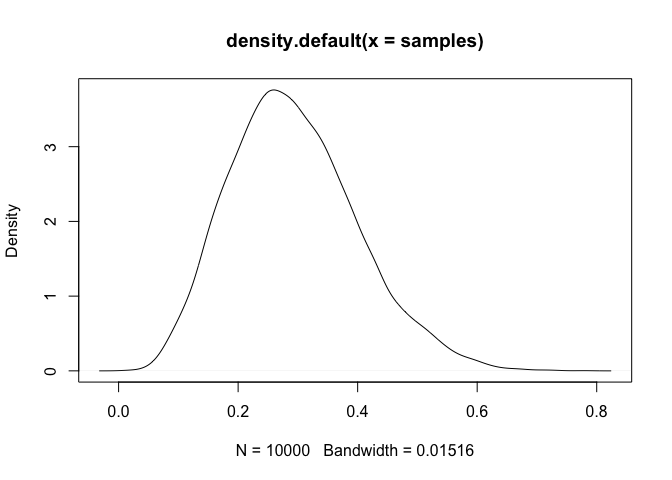
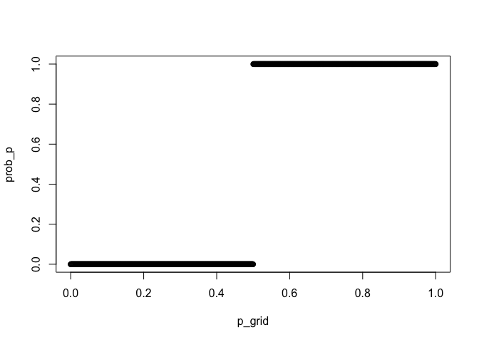
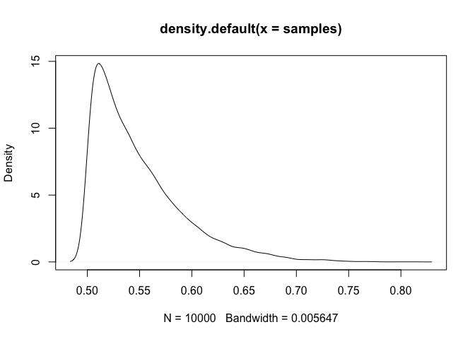

Week 1 HW
================
Juan Carlos Villaseñor-Derbez
12/7/2020

``` r
suppressPackageStartupMessages({
  library(rethinking)
})
```

# The model

Earth is covered by two things: land and water. The proportion of
samples indicating water can be described by:

\[
\]\[
\]

The process-generating model is a binomial distribution, with
probability p (portion of the world covered in water). Our prior is of
uniform distribution between 0 and 1.

# 1

Suppose the global tossing data (Chapter 2) had turned out to be 4 water
in 15 tosses. Construct the posterior distribution, using grid
approximation. Use the same flat prior as in the book.

``` r
W <- 4                                                 # Number of W observed
N <- 15                                                # Number of tosses

p_grid <- seq(from = 0, to = 1, length.out = 1e3)      # Create grid
prob_p <- rep(1, 1e3)                                  # Create uniform prior
prob_data <- dbinom(x = W, size = N, prob = p_grid)    # Calculate likelihood of each point on the grid
posterior <- prob_p * prob_data                        # Update posterior
posterior <- posterior / sum(posterior)                # Normalize posterior


set.seed(100)
samples <- sample(p_grid, size = 1e4, prob = posterior, replace = T)    # Sample the posterior
plot(density(samples))                                                  # Visualize the posterior
```

<!-- -->

``` r
mean(samples)
```

    ## [1] 0.2929688

# 2

Start over in 1, but now use a prior that is zero below \(p = 0.5\) and
a constant above \(p = 0.5\). This corresponds to prior information that
a majority of the Earth’s surface is water. What difference does the
better prior make?

``` r
prob_p <- rep(1, 1e3)                                  # Create uniform prior
prob_p[p_grid <= 0.5] <- 0
plot(p_grid, prob_p)
```

<!-- -->

``` r
prob_data <- dbinom(x = W, size = N, prob = p_grid)    # Calculate likelihood of each point on the grid
posterior <- prob_p * prob_data                        # Update posterior
posterior <- posterior / sum(posterior)                # Normalize posterior

set.seed(100)
samples <- sample(p_grid, size = 1e4, prob = posterior, replace = T)    # Sample the posterior
plot(density(samples))                                                  # Visualize the posterior
```

<!-- -->

``` r
mean(samples)
```

    ## [1] 0.5485953

# 3

For the posterior distribution from 2, compute 89% percentile and HPDI
intervals. Compare the widths of these intervals. Which is wider? Why?
If you had only the information in the interval, what might you
misunderstand about the shape of the posterior distribution?

``` r
HPDI(samples = samples, prob = 0.89)
```

    ##     |0.89     0.89| 
    ## 0.5005005 0.6046046

``` r
PI(samples = samples, prob = 0.89)
```

    ##        5%       94% 
    ## 0.5035035 0.6326326
