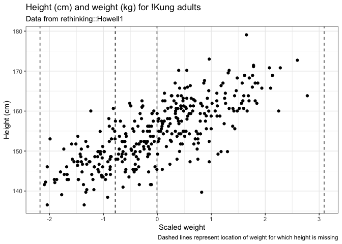
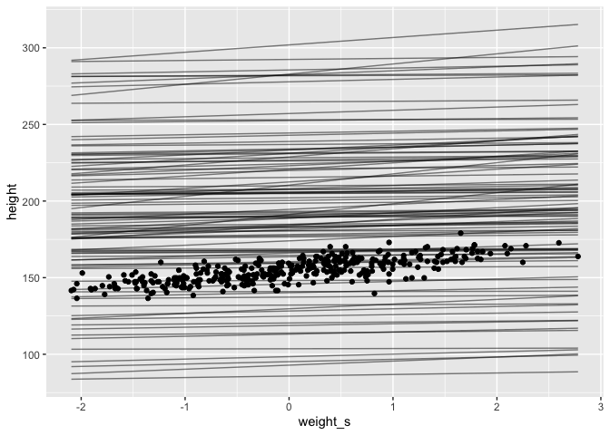
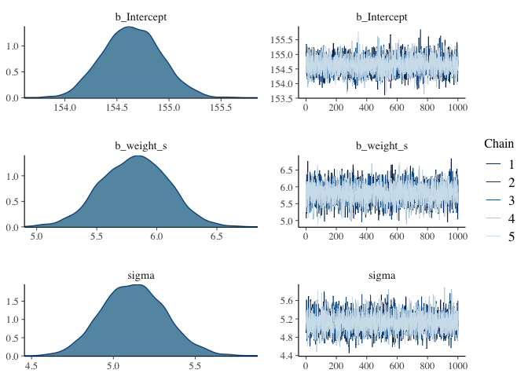
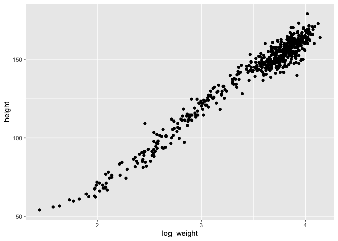
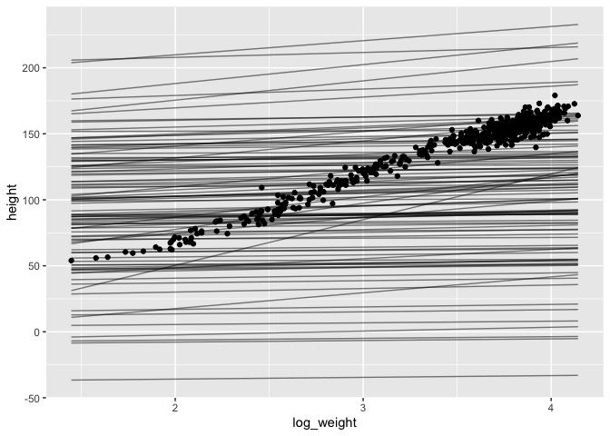
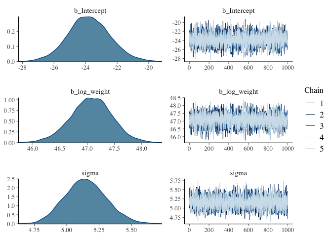
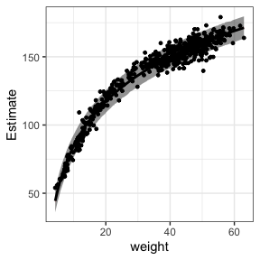
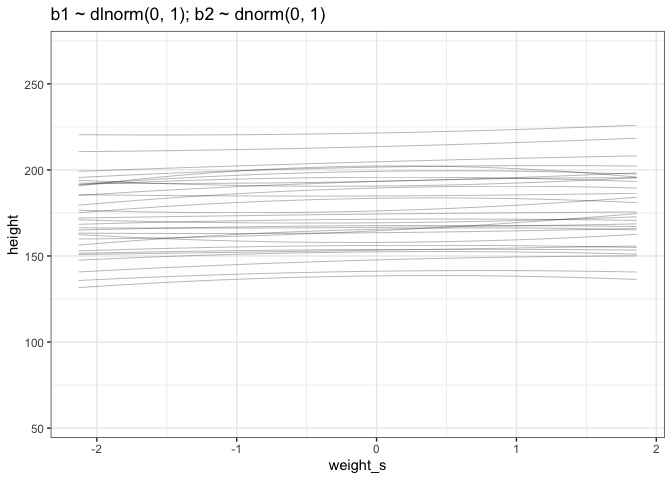
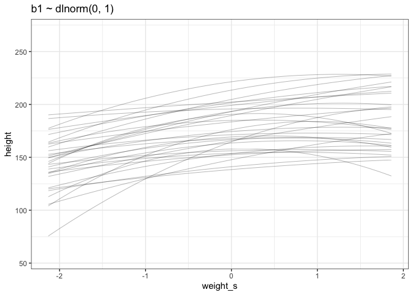

week 2 HW
================
Juan Carlos Villaseñor-Derbez
12/11/2020

# Predict missing heights for given weights

The given weight data are 45, 40, 65, and 31.

``` r
# Load data
data(Howell1)
# Keep adults only, and center/scale data
d2 <- Howell1 %>% 
  filter(age > 18) %>% 
  mutate(weight_s = (weight - mean(weight, na.rm = T)) / sd(weight, na.rm = T))

# Define missing data, will be useful for plotting and predicting
weights_missing <- c(45, 40, 65, 31)

ggplot(data = d2, aes(x = weight_s, y = height)) +
  geom_point() +
  geom_vline(xintercept = (weights_missing - mean(d2$weight)) / sd(d2$weight), linetype = "dashed") +
  theme_bw() +
  labs(title = "Height (cm) and weight (kg) for !Kung adults",
       subtitle = "Data from rethinking::Howell1",
       caption = "Dashed lines represent location of weight for which height is missing",
       x = "Scaled weight",
       y = "Height (cm)")
```

<!-- -->

Define the model to fit

  
 \\\\
\\mu_i = \\alpha + \\beta \\times \\text{weight_s}_i \\\\
\\alpha \\sim \\text{Normal}(195, 50) \\\\
\\beta \\sim \\text{Log-Normal}(0, 1) \\\\
\\sigma \\sim \\text{Cauchy}(0, 1)
")  
Simulate from the prior

``` r
n_lines <- 100
weight_ranges_s <- range((d2$weight - mean(d2$weight)) / sd(d2$weight))

tibble(n = 1:n_lines,
       a = rnorm(n = n_lines, mean = 195, sd = 50),
       b = rlnorm(n = n_lines, mean = 0, sd = 1)) %>% 
  expand(nesting(n, a, b), weight_s = weight_ranges_s) %>% 
  mutate(height = a + b * weight_s) %>% 
  ggplot(aes(x = weight_s, y = height)) +
  geom_line(aes(group = n),
            size = 0.5,
            alpha = 0.5) +
  geom_point(data = d2)
```

<!-- -->

Now actually fit the model

``` r
adult_model <- brm(formula = height ~ 1 + weight_s,
                   data = d2,
                   family = gaussian,
                   prior = c(prior(normal(195, 50), class = Intercept),
                             prior(lognormal(0, 1), class = b),
                             prior(cauchy(0, 1), class = sigma)),
                   chains = 5,
                   cores = 5,
                   seed = 4)
```

    ## Warning: It appears as if you have specified a lower bounded prior on a parameter that has no natural lower bound.
    ## If this is really what you want, please specify argument 'lb' of 'set_prior' appropriately.
    ## Warning occurred for prior 
    ## b ~ lognormal(0, 1)

    ## Compiling Stan program...

    ## Trying to compile a simple C file

    ## Running /Library/Frameworks/R.framework/Resources/bin/R CMD SHLIB foo.c
    ## /usr/local/opt/llvm/bin/clang -fopenmp -I"/Library/Frameworks/R.framework/Resources/include" -DNDEBUG   -I"/Library/Frameworks/R.framework/Versions/4.0/Resources/library/Rcpp/include/"  -I"/Library/Frameworks/R.framework/Versions/4.0/Resources/library/RcppEigen/include/"  -I"/Library/Frameworks/R.framework/Versions/4.0/Resources/library/RcppEigen/include/unsupported"  -I"/Library/Frameworks/R.framework/Versions/4.0/Resources/library/BH/include" -I"/Library/Frameworks/R.framework/Versions/4.0/Resources/library/StanHeaders/include/src/"  -I"/Library/Frameworks/R.framework/Versions/4.0/Resources/library/StanHeaders/include/"  -I"/Library/Frameworks/R.framework/Versions/4.0/Resources/library/RcppParallel/include/"  -I"/Library/Frameworks/R.framework/Versions/4.0/Resources/library/rstan/include" -DEIGEN_NO_DEBUG  -DBOOST_DISABLE_ASSERTS  -DBOOST_PENDING_INTEGER_LOG2_HPP  -DSTAN_THREADS  -DBOOST_NO_AUTO_PTR  -include '/Library/Frameworks/R.framework/Versions/4.0/Resources/library/StanHeaders/include/stan/math/prim/mat/fun/Eigen.hpp'  -D_REENTRANT -DRCPP_PARALLEL_USE_TBB=1   -I/usr/local/opt/gettext/include -I/usr/local/opt/llvm/include   -fPIC  -g -O3 -Wall -pedantic -std=gnu99 -mtune=native -pipe -c foo.c -o foo.o
    ## In file included from <built-in>:1:
    ## In file included from /Library/Frameworks/R.framework/Versions/4.0/Resources/library/StanHeaders/include/stan/math/prim/mat/fun/Eigen.hpp:13:
    ## In file included from /Library/Frameworks/R.framework/Versions/4.0/Resources/library/RcppEigen/include/Eigen/Dense:1:
    ## In file included from /Library/Frameworks/R.framework/Versions/4.0/Resources/library/RcppEigen/include/Eigen/Core:88:
    ## /Library/Frameworks/R.framework/Versions/4.0/Resources/library/RcppEigen/include/Eigen/src/Core/util/Macros.h:613:1: error: unknown type name 'namespace'
    ## namespace Eigen {
    ## ^
    ## /Library/Frameworks/R.framework/Versions/4.0/Resources/library/RcppEigen/include/Eigen/src/Core/util/Macros.h:613:16: error: expected ';' after top level declarator
    ## namespace Eigen {
    ##                ^
    ##                ;
    ## In file included from <built-in>:1:
    ## In file included from /Library/Frameworks/R.framework/Versions/4.0/Resources/library/StanHeaders/include/stan/math/prim/mat/fun/Eigen.hpp:13:
    ## In file included from /Library/Frameworks/R.framework/Versions/4.0/Resources/library/RcppEigen/include/Eigen/Dense:1:
    ## /Library/Frameworks/R.framework/Versions/4.0/Resources/library/RcppEigen/include/Eigen/Core:96:10: fatal error: 'complex' file not found
    ## #include <complex>
    ##          ^~~~~~~~~
    ## 3 errors generated.
    ## make: *** [foo.o] Error 1

    ## Start sampling

``` r
plot(adult_model)
```

<!-- -->

``` r
new_data <- tibble(weight = weights_missing) %>% 
  mutate(weight_s = (weight - mean(d2$weight)) / sd(d2$weight))

predict(adult_model, newdata = new_data, probs = c(0.055, 0.945)) %>% 
  data.frame() %>% 
  bind_cols(new_data) %>% 
  select(weight, weight_s, everything(), -Est.Error)
```

    ##   weight     weight_s Estimate     Q5.5    Q94.5
    ## 1     45 -0.007055198 154.6099 146.4866 162.7654
    ## 2     40 -0.781622179 150.1945 142.0803 158.2353
    ## 3     65  3.091212723 172.6520 164.3586 181.0342
    ## 4     31 -2.175842744 141.9798 133.6685 150.2983

# Linear-log model between height and log(weight)

Define some data

``` r
d <- Howell1 %>% 
  mutate(log_weight = log(weight))

ggplot(data = d, mapping = aes(x = log_weight, y = height)) +
  geom_point() 
```

<!-- --> Define model

  
 \\\\
\\mu_i = \\alpha + \\beta \\times log(\\text{weight}) \\\\
\\alpha = \\text{Normal}(100, 50) \\\\
\\beta = \\text{Log-Normal}(1, 1) \\\\
\\sigma = \\text{Cauchy}(0, 1)
")  

Simulate form the priors

``` r
n_lines <- 100
log_weight_ranges <- range(d$log_weight)

tibble(n = 1:n_lines,
       a = rnorm(n = n_lines, mean = 100, sd = 50),
       b = rlnorm(n = n_lines, mean = 1, sd = 1)) %>% 
  expand(nesting(n, a, b), log_weight = log_weight_ranges) %>% 
  mutate(height = a + b * log_weight) %>% 
  ggplot(aes(x = log_weight, y = height)) +
  geom_line(aes(group = n),
            size = 0.5,
            alpha = 0.5) +
  geom_point(data = d)
```

<!-- -->

Fit the model

``` r
all_kung <- 
  brm(formula = height ~ 1 +  log_weight,
      data = d,
      family = gaussian,
      prior = c(prior(normal(100, 50), class = Intercept),
                prior(lognormal(1, 1), class = b),
                prior(cauchy(0, 1), class = sigma)),
      chains = 5,
      cores = 5,
      seed = 4)
```

    ## Warning: It appears as if you have specified a lower bounded prior on a parameter that has no natural lower bound.
    ## If this is really what you want, please specify argument 'lb' of 'set_prior' appropriately.
    ## Warning occurred for prior 
    ## b ~ lognormal(1, 1)

    ## Compiling Stan program...

    ## Trying to compile a simple C file

    ## Running /Library/Frameworks/R.framework/Resources/bin/R CMD SHLIB foo.c
    ## /usr/local/opt/llvm/bin/clang -fopenmp -I"/Library/Frameworks/R.framework/Resources/include" -DNDEBUG   -I"/Library/Frameworks/R.framework/Versions/4.0/Resources/library/Rcpp/include/"  -I"/Library/Frameworks/R.framework/Versions/4.0/Resources/library/RcppEigen/include/"  -I"/Library/Frameworks/R.framework/Versions/4.0/Resources/library/RcppEigen/include/unsupported"  -I"/Library/Frameworks/R.framework/Versions/4.0/Resources/library/BH/include" -I"/Library/Frameworks/R.framework/Versions/4.0/Resources/library/StanHeaders/include/src/"  -I"/Library/Frameworks/R.framework/Versions/4.0/Resources/library/StanHeaders/include/"  -I"/Library/Frameworks/R.framework/Versions/4.0/Resources/library/RcppParallel/include/"  -I"/Library/Frameworks/R.framework/Versions/4.0/Resources/library/rstan/include" -DEIGEN_NO_DEBUG  -DBOOST_DISABLE_ASSERTS  -DBOOST_PENDING_INTEGER_LOG2_HPP  -DSTAN_THREADS  -DBOOST_NO_AUTO_PTR  -include '/Library/Frameworks/R.framework/Versions/4.0/Resources/library/StanHeaders/include/stan/math/prim/mat/fun/Eigen.hpp'  -D_REENTRANT -DRCPP_PARALLEL_USE_TBB=1   -I/usr/local/opt/gettext/include -I/usr/local/opt/llvm/include   -fPIC  -g -O3 -Wall -pedantic -std=gnu99 -mtune=native -pipe -c foo.c -o foo.o
    ## In file included from <built-in>:1:
    ## In file included from /Library/Frameworks/R.framework/Versions/4.0/Resources/library/StanHeaders/include/stan/math/prim/mat/fun/Eigen.hpp:13:
    ## In file included from /Library/Frameworks/R.framework/Versions/4.0/Resources/library/RcppEigen/include/Eigen/Dense:1:
    ## In file included from /Library/Frameworks/R.framework/Versions/4.0/Resources/library/RcppEigen/include/Eigen/Core:88:
    ## /Library/Frameworks/R.framework/Versions/4.0/Resources/library/RcppEigen/include/Eigen/src/Core/util/Macros.h:613:1: error: unknown type name 'namespace'
    ## namespace Eigen {
    ## ^
    ## /Library/Frameworks/R.framework/Versions/4.0/Resources/library/RcppEigen/include/Eigen/src/Core/util/Macros.h:613:16: error: expected ';' after top level declarator
    ## namespace Eigen {
    ##                ^
    ##                ;
    ## In file included from <built-in>:1:
    ## In file included from /Library/Frameworks/R.framework/Versions/4.0/Resources/library/StanHeaders/include/stan/math/prim/mat/fun/Eigen.hpp:13:
    ## In file included from /Library/Frameworks/R.framework/Versions/4.0/Resources/library/RcppEigen/include/Eigen/Dense:1:
    ## /Library/Frameworks/R.framework/Versions/4.0/Resources/library/RcppEigen/include/Eigen/Core:96:10: fatal error: 'complex' file not found
    ## #include <complex>
    ##          ^~~~~~~~~
    ## 3 errors generated.
    ## make: *** [foo.o] Error 1

    ## Start sampling

``` r
plot(all_kung)
```

<!-- -->

``` r
mu <- fitted(all_kung, probs = c(0.055, 0.945)) %>% 
  data.frame() %>% 
  mutate(log_weight = d$log_weight,
         weight = d$weight)

height <- predict(all_kung, probs = c(0.055, 0.945)) %>% 
  data.frame() %>% 
  mutate(log_weight = d$log_weight,
         weight = d$weight)

ggplot(mapping = aes(x = weight)) +
  geom_ribbon(data = height, aes(ymin = Q5.5, ymax = Q94.5),
              alpha = 0.5) +
  geom_smooth(data = mu,
              aes(y = Estimate, ymin = Q5.5, ymax = Q94.5),
              stat = "identity",
              color = "black",
              fill = "red",
              alpha = 0.5) +
  geom_point(data = d, aes(y = height),
             size = 1) +
  theme_bw()
```

<!-- -->

# Plot prior predictive distribution

For a Quadratic model

  
 \\\\
\\mu_i &= a + \\beta_1weight\\_s_i + \\beta_2weight\\_s_i^2\\\\
\\alpha &\\sim Normal(178, 20)\\\\
\\beta_1 &\\sim Log-Normal(0, 1) \\\\
\\beta_2 &\\sim Normal(0, 1) \\\\
\\sigma &\\sim Uniform(0, 50)
\\end{align}
")  

Simulating from the priors

``` r
set.seed(2971)
n_lines <- 30

tibble(n = 1:n_lines,
       a = rnorm(n = n_lines, mean = 178, sd = 20),
       b_1 = rlnorm(n = n_lines, mean = 0, sd = 1),
       b_2 = rnorm(n = n_lines, mean = 0, sd = 1)) %>% 
  expand(nesting(n, a, b_1, b_2), weight = seq(from = min(d$weight), to = max(d$weight), length.out = 30)) %>% 
  mutate(weight_s = (weight - mean(d$weight)) / sd(d$weight),
         weight_s2 = weight_s ^ 2,
         height = a + b_1 * weight_s + b_2 *weight_s2) %>% 
  ggplot(aes(x = weight_s, y = height)) +
  geom_line(size = 0.1, aes(group = n)) +
  theme_bw() +
  labs(title = "b1 ~ dlnorm(0, 1); b2 ~ dnorm(0, 1)") +
  ylim(55, 270)
```

<!-- -->

Try tighter / different priors

``` r
set.seed(2971)
n_lines <- 30

tibble(n = 1:n_lines,
       a = rnorm(n = n_lines, mean = 178, sd = 20),
       b_1 = rlnorm(n = n_lines, mean = 2, sd = 1),
       b_2 = rlnorm(n = n_lines, mean = 1, sd = 1)) %>% 
  expand(nesting(n, a, b_1, b_2), weight = seq(from = min(d$weight), to = max(d$weight), length.out = 30)) %>% 
  mutate(weight_s = (weight - mean(d$weight)) / sd(d$weight),
         weight_s2 = weight_s ^ 2,
         height = a + b_1 * weight_s - b_2 *weight_s2) %>% 
  ggplot(aes(x = weight_s, y = height)) +
  geom_line(size = 0.1, aes(group = n)) +
  theme_bw() +
  labs(title = "b1 ~ dlnorm(0, 1)") +
  ylim(55, 270)
```

<!-- -->
